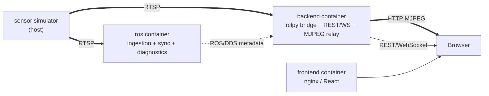

# MultiSens

[](https://github.com/CosminBMemetea/multisens/releases/tag/v0.1.0)

An open-source, vendor-neutral platform for ingesting, synchronizing,
diagnosing, and visualizing multi-sensor streams — RGB, depth, thermal, and
whatever else speaks RTSP.

## What MultiSens is

- A generic, **configuration-driven** RTSP ingestion pipeline on ROS 2
  Humble: one node type, N sensors, no per-sensor code.
- A real **cross-sensor timestamp synchronization** service, with an
  evidence-based tolerance, not a guessed one.
- A **diagnostics system** where every number is either a genuine
  measurement or explicitly `"unavailable"` — never fabricated.
- A **dashboard** (React, dark technical UI) showing live video, connection
  state, FPS, sync skew, and system health, backed by a REST/WebSocket API
  that never leaks a ROS message type to the browser.
- Built to work identically whether a stream comes from the reference
  webcam simulator, a real sensor, or a gateway that happens to speak RTSP.

## What MultiSens is NOT

- **Not a perception or ML platform.** No inference, no NCAP/DMS/OMS logic,
  no object detection, nothing that interprets *what's in* a frame.
- **Not a fusion or ground-truth evaluation tool** (yet — see
  [Roadmap](#roadmap)).
- **Not tied to any vendor, OEM, or dataset.** No proprietary integration,
  no hardcoded sensor brand, no code specific to the reference simulator
  anywhere outside its own config entry.
- **Not a production-hardened, multi-user, authenticated service.** CORS is
  wide open, there's no auth, and it assumes a single local dashboard user —
  all deliberate v0.1 scope, not oversights. See
  [docs/limitations.md](docs/limitations.md).
- **Not RViz or Foxglove.** Those remain valid developer tools for
  inspecting the ROS graph directly; MultiSens's dashboard is the product
  UI, and doesn't depend on either.

## Architecture

Three containers, one host-side simulator that's explicitly *not* part of
MultiSens:



Four boundaries, each carrying exactly one kind of traffic — video and
metadata never share a transport, and ROS/DDS never talks to the browser
directly. Full diagram, container topology rationale, and the measured
evidence behind each major decision: [docs/architecture.md](docs/architecture.md).

## Quick start

```bash
git clone https://github.com/CosminBMemetea/multisens.git
cd multisens
docker compose up -d
docker compose ps          # ros, backend, frontend should all show "healthy"
open http://localhost:8080 # the dashboard
```

This alone gets you the ROS graph, the backend, and the dashboard running —
you still need an RTSP source for it to show anything (see next section).

## Simulator dependency

MultiSens ingests from RTSP; it does not produce sensor data itself. For
local development, the reference simulator is a separate repository:
[`multirtsp`](https://github.com/CosminBMemetea/multirtsp) — one MacBook
webcam, split via `ffmpeg` into three RTSP paths (`rgb`, `depth`, `thermal`)
served by MediaMTX. Start it before `docker compose up`:

```bash
# from a checkout of https://github.com/CosminBMemetea/multirtsp
mediamtx ./mediamtx.yml
./stream_macos.sh
```

Nothing in MultiSens's core code (`ros2_ws/`, `backend/`, `frontend/`)
references this simulator — the only place it appears is as URLs in
`config/sensors.yaml`. Point that file at real sensors and the simulator is
never needed.

## Physical vs. simulated — a hard distinction

Every sensor in `config/sensors.yaml` declares `source_type: physical` or
`source_type: simulated`, and that value flows untouched through
diagnostics, the ROS graph, and the dashboard's badges. In the reference
setup: `rgb` is a real webcam feed (`physical`); `depth` and `thermal` are
FFmpeg `pseudocolor` transforms of that same feed (`simulated`) — visually
similar to real depth/thermal output, but never claimed to be a physical
measurement anywhere in the system. This distinction exists specifically so
a consumer of MultiSens's data can never mistake synthetic data for real
sensor output. See [docs/connector-api.md](docs/connector-api.md) for the
full config schema and what happens automatically once a sensor is added.

## Docker requirements

- Docker Desktop. Developed and verified with 6GB RAM / 7 CPU allocated to
  the VM on an Apple Silicon (M2) host — base images confirmed multi-arch
  (arm64/v8), no architecture-specific code.
- Nothing else on the host required. The frontend builds entirely inside
  its own Docker multi-stage build; Node/npm locally is only useful for
  faster dev iteration (`cd frontend && npm run dev`), never required for
  `docker compose up`.
- See [docs/configuration.md](docs/configuration.md) for every environment
  variable, port, and volume mount `docker-compose.yml` uses.

## URLs

| What | URL |
|---|---|
| Dashboard | http://localhost:8080 |
| Backend REST | http://localhost:8000/api/* |
| Backend WebSocket | ws://localhost:8000/ws/status |
| MJPEG video (per sensor) | http://localhost:8000/api/sensors/{id}/stream.mjpeg |

Full API surface: [docs/connector-api.md](docs/connector-api.md#backend-api-surface-for-building-an-alternative-frontend-or-scripting).

## ROS topics

| Topic | Type |
|---|---|
| `/multisens/sensors/{modality}/image_raw` | `sensor_msgs/Image` |
| `/multisens/sensors/{modality}/frame_stamp` | `sensor_msgs/TimeReference` |
| `/multisens/diagnostics` | `diagnostic_msgs/DiagnosticArray` |
| `/multisens/sync/status` | `diagnostic_msgs/DiagnosticArray` |

No custom `.msg` files anywhere in this repo. Full contract, QoS, and every
diagnostic field's meaning: [docs/topics.md](docs/topics.md).

## Known limitations

The authoritative, current list — scope boundaries, environment-specific
assumptions, and honestly-reported gaps (no CI yet, soak testing is real
but time-bounded, single-dashboard-user scale only) — lives in
[docs/limitations.md](docs/limitations.md), not duplicated here since it
changes independently of this README.

## Roadmap

v0.1 is ingestion, synchronization, diagnostics, and visualization. Not yet
built, deliberately: perception/ML inference, sensor fusion, ground-truth
comparison, ablation studies, evaluation frameworks, NCAP/DMS/OMS-specific
logic, real depth/thermal sensor conversion, authentication, cloud
deployment. See the project's phase-by-phase history in
[CHANGELOG.md](CHANGELOG.md) for how v0.1 itself was built and verified.

## Documentation

- [docs/architecture.md](docs/architecture.md) — system design and the
  reasoning behind it
- [docs/topics.md](docs/topics.md) — ROS topic/message contract
- [docs/configuration.md](docs/configuration.md) — every config surface
- [docs/diagnostics.md](docs/diagnostics.md) — how to read the health model
- [docs/connector-api.md](docs/connector-api.md) — adding a sensor, backend API
- [docs/development.md](docs/development.md) — repo layout, tests, dev workflow
- [docs/limitations.md](docs/limitations.md) — what v0.1 doesn't do, and why
- [CHANGELOG.md](CHANGELOG.md) — what shipped, what was fixed, verified how

## License

Apache-2.0 — see [LICENSE](LICENSE).
