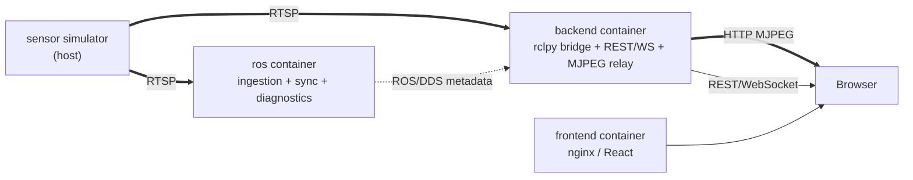

# MultiSens

[](https://github.com/CosminBMemetea/multisens/releases/tag/v0.4.0)

An open-source, vendor-neutral platform for ingesting, synchronizing,
diagnosing, and visualizing multi-sensor streams — RGB, depth, thermal, and
whatever else speaks RTSP.

## What MultiSens is

- A generic, **configuration-driven** RTSP ingestion pipeline on ROS 2
  Humble: one node type, N sensors, no per-sensor code.
- A real **cross-sensor timestamp synchronization** service, with an
  evidence-based tolerance, not a guessed one.
- A **diagnostics system** where every number is either a genuine
  measurement or explicitly `"unavailable"` — never fabricated.
- A **dashboard** (React, dark technical UI) showing live video, connection
  state, FPS, sync skew, and system health, backed by a REST/WebSocket API
  that never leaks a ROS message type to the browser.
- An **evaluation layer** (v0.2): sessions, scenarios, ground-truth and
  prediction ingestion (from anywhere — see
  [What MultiSens is NOT](#what-multisens-is-not)), timestamp matching
  with a configurable tolerance, and classification metrics (accuracy,
  macro/micro precision/recall/F1, a dynamic confusion matrix) — every
  unavailable metric shown as `N/A`, never a fabricated zero. Full
  contract: [docs/evaluation.md](docs/evaluation.md).
- A **configuration comparison layer** (v0.3): what changed when a
  sensor was added or removed, reported two ways (as-persisted and over
  a common matched population), with an evidence-quality validity
  verdict and never a causal claim — "configuration B measured +0.07 F1
  higher than A," never "sensor X caused a +7% improvement." Ablation is
  a comparison view (baseline = the full configuration), not a separate
  concept. Full contract: [docs/comparison.md](docs/comparison.md).
- A **requirement profile / coverage layer** (v0.4): define generic,
  hierarchical requirements with open-ended conditions and acceptance
  criteria (`recall_macro >= 0.90`, `coverage >= 0.95`, ...) against any
  metric v0.2/v0.3 already produce, and see which sensor configurations
  satisfy them — `PASS`/`FAIL`/`N/A` per requirement, coverage and
  evidence-completeness always shown together, every result traceable to
  its exact evidence. No built-in knowledge of any specific requirement
  framework (not NCAP, not a DMS/OMS scheme) — external users build
  those with the same generic shapes this core exposes. Full contract:
  [docs/profiles.md](docs/profiles.md) /
  [docs/coverage.md](docs/coverage.md).
- Built to work identically whether a stream comes from the reference
  webcam simulator, a real sensor, or a gateway that happens to speak RTSP.

## What MultiSens is NOT

- **Not a perception or ML platform, and not a regulatory or
  certification authority.** No inference, no NCAP/DMS/OMS logic, no
  object detection, no "compliant"/"certified"/"safety score" claim
  anywhere in the UI. MultiSens evaluates predictions; it does not
  produce them — a prediction may come from ROS, REST, an imported file,
  another computer, or proprietary software, and MultiSens doesn't need
  to know which. v0.4's requirement profiles judge caller-defined
  acceptance criteria against evidence — a different, narrower claim
  than any compliance framework's, and one an external user's profile
  document carries, not the MultiSens core. See
  [docs/profiles.md](docs/profiles.md#what-this-layer-answers).
- **Not a sensor-fusion tool, and not a causal-attribution tool.**
  MultiSens never runs fusion algorithms, and v0.3's comparison layer
  never claims a sensor *caused* a change — only that two configurations
  *measured* differently under stated conditions. See
  [docs/comparison.md](docs/comparison.md#non-causal-by-design).
- **Evaluation is classification-only** (v0.2) — the domain model is
  deliberately generic (see
  [docs/evaluation.md](docs/evaluation.md#task-values-generic-by-design)),
  but detection/regression metric engines don't exist yet.
- **Not tied to any vendor, OEM, or dataset.** No proprietary integration,
  no hardcoded sensor brand, no code specific to the reference simulator
  anywhere outside its own config entry.
- **Not a production-hardened, multi-user, authenticated service.** CORS is
  wide open, there's no auth, and it assumes a single local dashboard user —
  all deliberate scope, not oversights. See
  [docs/limitations.md](docs/limitations.md).
- **Not RViz or Foxglove.** Those remain valid developer tools for
  inspecting the ROS graph directly; MultiSens's dashboard is the product
  UI, and doesn't depend on either.

## Architecture

Three containers, one host-side simulator that's explicitly *not* part of
MultiSens:



Four boundaries, each carrying exactly one kind of traffic — video and
metadata never share a transport, and ROS/DDS never talks to the browser
directly. Full diagram, container topology rationale, and the measured
evidence behind each major decision: [docs/architecture.md](docs/architecture.md).

## Quick start

```bash
git clone https://github.com/CosminBMemetea/multisens.git
cd multisens
docker compose up -d
docker compose ps          # ros, backend, frontend should all show "healthy"
open http://localhost:8080 # the dashboard
```

This alone gets you the ROS graph, the backend, and the dashboard running —
you still need an RTSP source for it to show anything (see next section).

## Simulator dependency

MultiSens ingests from RTSP; it does not produce sensor data itself. For
local development, the reference simulator is a separate repository:
[`multirtsp`](https://github.com/CosminBMemetea/multirtsp) — one MacBook
webcam, split via `ffmpeg` into three RTSP paths (`rgb`, `depth`, `thermal`)
served by MediaMTX. Start it before `docker compose up`:

```bash
# from a checkout of https://github.com/CosminBMemetea/multirtsp
mediamtx ./mediamtx.yml
./stream_macos.sh
```

Nothing in MultiSens's core code (`ros2_ws/`, `backend/`, `frontend/`)
references this simulator — the only place it appears is as URLs in
`config/sensors.yaml`. Point that file at real sensors and the simulator is
never needed.

## Physical vs. simulated — a hard distinction

Every sensor in `config/sensors.yaml` declares `source_type: physical` or
`source_type: simulated`, and that value flows untouched through
diagnostics, the ROS graph, and the dashboard's badges. In the reference
setup: `rgb` is a real webcam feed (`physical`); `depth` and `thermal` are
FFmpeg `pseudocolor` transforms of that same feed (`simulated`) — visually
similar to real depth/thermal output, but never claimed to be a physical
measurement anywhere in the system. This distinction exists specifically so
a consumer of MultiSens's data can never mistake synthetic data for real
sensor output. See [docs/connector-api.md](docs/connector-api.md) for the
full config schema and what happens automatically once a sensor is added.

## Evaluation quick start (v0.2)

Independent of the live dashboard above — works with or without an RTSP
source connected. Loads a deterministic, clearly-labeled **synthetic**
dataset (100 ground-truth samples, seven prediction configurations —
every non-empty subset of `{rgb, depth, thermal}` — at exact-by-
construction accuracies forming a clean lattice) through the ordinary
REST API:

```bash
docker compose up -d
python3 scripts/load_demo_data.py
open http://localhost:8080/sessions
```

See [examples/evaluation/README.md](examples/evaluation/README.md) for
exactly what the dataset is (and isn't — it does not represent real
sensor performance) and [docs/evaluation.md](docs/evaluation.md) for the
full domain model, matching algorithm, metric semantics, and API surface.

## Comparison quick start (v0.3)

Uses the same demo session as above — evaluate at least two
configurations first, then:

```bash
open http://localhost:8080/comparison
```

Pick a session, task, and baseline configuration, hit **Compare**. The
seven-configuration demo above is deliberately built so every comparison
between two of its configurations is `VALID` and no sensor removal ever
shows an improvement — a clean first look at the Sensor Addition,
Ablation, and General Comparison sections. Full contract:
[docs/comparison.md](docs/comparison.md).

## Requirement profile / coverage quick start (v0.4)

A separate, deliberately generic demo — "Generic Cabin Safety Demo," not
NCAP or any other real framework — four sessions across
`illumination`/`occlusion` conditions, six requirements, exact-by-
construction accuracies:

```bash
docker compose up -d
python3 scripts/load_profile_demo_data.py
open http://localhost:8080/profiles
```

Open "Generic Cabin Safety Demo," hit **Compute coverage**. Every
configuration passes a genuinely different subset of the six
requirements (17%/33%/50%/67%/100% coverage) — click any cell to see
exactly which evidence produced it. See
[examples/profiles/README.md](examples/profiles/README.md) for the full
derivation and [docs/profiles.md](docs/profiles.md) /
[docs/coverage.md](docs/coverage.md) for the domain model and API.

## Docker requirements

- Docker Desktop. Developed and verified with 6GB RAM / 7 CPU allocated to
  the VM on an Apple Silicon (M2) host — base images confirmed multi-arch
  (arm64/v8), no architecture-specific code.
- Nothing else on the host required. The frontend builds entirely inside
  its own Docker multi-stage build; Node/npm locally is only useful for
  faster dev iteration (`cd frontend && npm run dev`), never required for
  `docker compose up`.
- See [docs/configuration.md](docs/configuration.md) for every environment
  variable, port, and volume mount `docker-compose.yml` uses.

## URLs

| What | URL |
|---|---|
| Dashboard | http://localhost:8080 |
| Sessions / Evaluation (v0.2) | http://localhost:8080/sessions |
| Comparison (v0.3) | http://localhost:8080/comparison |
| Profiles / Coverage (v0.4) | http://localhost:8080/profiles |
| Backend REST | http://localhost:8000/api/* |
| Backend WebSocket | ws://localhost:8000/ws/status |
| MJPEG video (per sensor) | http://localhost:8000/api/sensors/{id}/stream.mjpeg |

Full v0.1 API surface: [docs/connector-api.md](docs/connector-api.md#backend-api-surface-for-building-an-alternative-frontend-or-scripting).
Full evaluation API surface: [docs/evaluation.md](docs/evaluation.md#api-surface).
Full comparison API surface: [docs/comparison.md](docs/comparison.md#api-surface).
Full profile/coverage API surface: [docs/profiles.md](docs/profiles.md#api-surface) / [docs/coverage.md](docs/coverage.md#api-surface).

## ROS topics

| Topic | Type |
|---|---|
| `/multisens/sensors/{modality}/image_raw` | `sensor_msgs/Image` |
| `/multisens/sensors/{modality}/frame_stamp` | `sensor_msgs/TimeReference` |
| `/multisens/diagnostics` | `diagnostic_msgs/DiagnosticArray` |
| `/multisens/sync/status` | `diagnostic_msgs/DiagnosticArray` |

No custom `.msg` files anywhere in this repo. Full contract, QoS, and every
diagnostic field's meaning: [docs/topics.md](docs/topics.md).

## Known limitations

The authoritative, current list — scope boundaries, environment-specific
assumptions, and honestly-reported gaps (no CI yet, soak testing is real
but time-bounded, single-dashboard-user scale only) — lives in
[docs/limitations.md](docs/limitations.md), not duplicated here since it
changes independently of this README.

## Roadmap

v0.1 delivered ingestion, synchronization, diagnostics, and visualization.
v0.2 added the evaluation layer on top: sessions, scenarios, ground-truth/
prediction ingestion from any source, timestamp matching, and
classification metrics (comparison table, confusion matrix, timeline) —
see [docs/evaluation.md](docs/evaluation.md). v0.3 added configuration
comparison on top of that: metric/coverage deltas reported two ways
(as-persisted and over a common matched population), sensor addition/
removal relationships, ablation as a comparison view, a non-causal
evidence-quality validity verdict, and deterministic multi-source
ambiguity handling — see [docs/comparison.md](docs/comparison.md). v0.4
added requirement profiles and coverage on top of that: generic
hierarchical requirement groups with open-ended conditions, deterministic
evidence selection (never ambiguous, never guessed), acceptance criteria
against any existing metric, `PASS`/`FAIL`/`N/A` per requirement, and
recursive coverage/completeness aggregation that never averages
percentages or hides N/A behind a flattering number — see
[docs/profiles.md](docs/profiles.md) / [docs/coverage.md](docs/coverage.md).

Not yet built, deliberately: perception/ML inference (MultiSens evaluates
predictions, it does not produce them), sensor fusion, causal/statistical
claims (no p-values, no confidence intervals, no "sensor X caused Y"),
detection/regression metric engines (the domain model already supports
them; the evaluators don't exist yet), NCAP/DMS/OMS-specific logic or any
other built-in regulatory/certification framework, a condition-exploration
UI (v0.4 preserves the metadata a later release would need), decision
support ("minimum sufficient configuration"), weighted/mandatory
requirement aggregation, real depth/thermal sensor conversion, a
file-import API endpoint, authentication, cloud deployment. See
[CHANGELOG.md](CHANGELOG.md) for how each release was built and verified.

## Documentation

- [docs/architecture.md](docs/architecture.md) — system design and the
  reasoning behind it
- [docs/evaluation.md](docs/evaluation.md) — evaluation domain model,
  matching, metrics, API surface (v0.2)
- [docs/comparison.md](docs/comparison.md) — comparison domain model,
  validity semantics, ambiguity handling, API surface (v0.3)
- [docs/profiles.md](docs/profiles.md) — requirement profile domain
  model, validation, storage, API surface (v0.4)
- [docs/coverage.md](docs/coverage.md) — evidence selection, acceptance
  engine, coverage aggregation, API surface, frontend (v0.4)
- [docs/topics.md](docs/topics.md) — ROS topic/message contract
- [docs/configuration.md](docs/configuration.md) — every config surface
- [docs/diagnostics.md](docs/diagnostics.md) — how to read the health model
- [docs/connector-api.md](docs/connector-api.md) — adding a sensor, backend API
- [docs/development.md](docs/development.md) — repo layout, tests, dev workflow
- [docs/limitations.md](docs/limitations.md) — what MultiSens doesn't do, and why
- [CHANGELOG.md](CHANGELOG.md) — what shipped, what was fixed, verified how

## License

Apache-2.0 — see [LICENSE](LICENSE).
