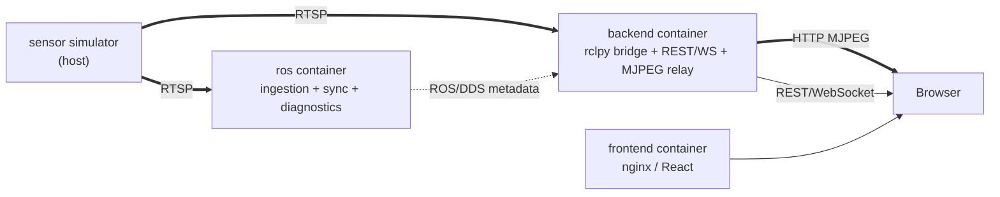

# MultiSens

[](https://github.com/CosminBMemetea/multisens/releases/tag/v0.7.0)

An open-source, vendor-neutral platform for ingesting, synchronizing,
diagnosing, and visualizing multi-sensor streams — RGB, depth, thermal, and
whatever else speaks RTSP.

## What MultiSens is

- A generic, **configuration-driven** RTSP ingestion pipeline on ROS 2
  Humble: one node type, N sensors, no per-sensor code.
- A real **cross-sensor timestamp synchronization** service, with an
  evidence-based tolerance, not a guessed one.
- A **diagnostics system** where every number is either a genuine
  measurement or explicitly `"unavailable"` — never fabricated.
- A **dashboard** (React, dark technical UI) showing live video, connection
  state, FPS, sync skew, and system health, backed by a REST/WebSocket API
  that never leaks a ROS message type to the browser.
- An **evaluation layer** (v0.2): sessions, scenarios, ground-truth and
  prediction ingestion (from anywhere — see
  [What MultiSens is NOT](#what-multisens-is-not)), timestamp matching
  with a configurable tolerance, and classification metrics (accuracy,
  macro/micro precision/recall/F1, a dynamic confusion matrix) — every
  unavailable metric shown as `N/A`, never a fabricated zero. Full
  contract: [docs/evaluation.md](docs/evaluation.md).
- A **configuration comparison layer** (v0.3): what changed when a
  sensor was added or removed, reported two ways (as-persisted and over
  a common matched population), with an evidence-quality validity
  verdict and never a causal claim — "configuration B measured +0.07 F1
  higher than A," never "sensor X caused a +7% improvement." Ablation is
  a comparison view (baseline = the full configuration), not a separate
  concept. Full contract: [docs/comparison.md](docs/comparison.md).
- A **requirement profile / coverage layer** (v0.4): define generic,
  hierarchical requirements with open-ended conditions and acceptance
  criteria (`recall_macro >= 0.90`, `coverage >= 0.95`, ...) against any
  metric v0.2/v0.3 already produce, and see which sensor configurations
  satisfy them — `PASS`/`FAIL`/`N/A` per requirement, coverage and
  evidence-completeness always shown together, every result traceable to
  its exact evidence. No built-in knowledge of any specific requirement
  framework — external users build those with the same generic shapes
  this core exposes. Full contract:
  [docs/profiles.md](docs/profiles.md) /
  [docs/coverage.md](docs/coverage.md).
- A **condition-exploration layer** (v0.5): filter, group, and cross-
  tabulate a profile's already-computed coverage by declared condition
  (`illumination=night`, `occlusion=partial`, ...) — dynamic filter
  controls discovered from the profile itself, a 2D condition cross-tab,
  a failure explorer, an N/A breakdown that distinguishes "no experiment
  performed" from "the evaluation itself has a gap," and full
  requirement-to-evidence traceability. Never re-decides `PASS`/`FAIL`/
  `N/A` and never a causal claim — only slices and counts what v0.4
  already decided. Full contract:
  [docs/condition-explorer.md](docs/condition-explorer.md).
- A **decision-support layer** (v0.6): given an explicit, caller-supplied
  policy (never a default), which sensor configurations are `SUFFICIENT`
  — and is there a smaller one that's tied for sufficient too? Minimum
  sufficient sets by strict set-inclusion minimality (never sensor-count
  sorting, never narrowed to one when several tie), a Pareto/dominance
  trade-off front across sensor count vs. coverage vs. completeness, and
  requirement-gap closure comparing two configurations across four
  separately-exposed transition categories. Sensor removal is reported as
  "removable without violating the current policy" / "policy-critical
  within this configuration" — scoped wording only, never "redundant
  sensor" as an intrinsic property, and never a universal importance
  score. Full contract: [docs/decision-support.md](docs/decision-support.md).
- A **resource observation & deployment trade-off layer** (v0.7): what
  does a sensor configuration actually cost to run — CPU, memory,
  network, latency, FPS — attributed per configuration per session, with
  every value carrying explicit provenance (`measured`/`declared`/
  `estimated`/`unavailable`, never a fabricated number). Joins that
  resource evidence with v0.6's decision evidence into one trade-off
  view: resource constraints (reusing the same acceptance-criterion
  grammar), a resource-aware generalized Pareto front, and observed
  (never causal) resource deltas between two configurations —
  comparability itself gated on matching execution platform, resolution,
  target FPS, and measurement duration. Two independent, non-cabin demo
  families ship with this release — **RideSafe** (70mai front/rear
  dashcams, ride monitoring and incident evidence) and **PropertyWatch**
  (generic home/garage/workshop/storage/small-warehouse multi-camera
  monitoring, no face-recognition or surveillance-identification). Full
  contract: [docs/resources.md](docs/resources.md) /
  [docs/deployment-tradeoffs.md](docs/deployment-tradeoffs.md). Provenance
  discipline across every layer, consolidated in one place:
  [docs/provenance.md](docs/provenance.md).
- Built to work identically whether a stream comes from the reference
  webcam simulator, a real sensor, or a gateway that happens to speak RTSP.

## What MultiSens is NOT

- **Not a perception or ML platform.** No inference, no object
  detection, no "compliant"/"certified"/"safety score" claim anywhere
  in the UI. MultiSens evaluates predictions; it does not
  produce them — a prediction may come from ROS, REST, an imported file,
  another computer, or proprietary software, and MultiSens doesn't need
  to know which. v0.4's requirement profiles judge caller-defined
  acceptance criteria against evidence — a different, narrower claim
  than any compliance framework's, and one an external user's profile
  document carries, not the MultiSens core. See
  [docs/profiles.md](docs/profiles.md#what-this-layer-answers).
- **Not a sensor-fusion tool, and not a causal-attribution tool.**
  MultiSens never runs fusion algorithms, and v0.3's comparison layer
  never claims a sensor *caused* a change — only that two configurations
  *measured* differently under stated conditions. v0.5's condition
  explorer carries the same discipline forward: "observed coverage under
  condition X," never "X caused this outcome." v0.6's decision-support
  layer extends it once more: a sensor is "removable without violating
  the current policy" or "policy-critical within this configuration" —
  never "redundant" or "necessary" as an intrinsic property, and there is
  no universal sensor-importance score anywhere. v0.7's resource deltas
  keep the same posture: "candidate used +5.1 Mbps more than baseline,"
  never "the added sensor cost 5.1 Mbps" — and there is no combined
  decision+resource score anywhere either. See
  [docs/comparison.md](docs/comparison.md#non-causal-by-design).
- **Evaluation is classification-only** (v0.2) — the domain model is
  deliberately generic (see
  [docs/evaluation.md](docs/evaluation.md#task-values-generic-by-design)),
  but detection/regression metric engines don't exist yet.
- **Not tied to any vendor, OEM, or dataset.** No proprietary integration,
  no hardcoded sensor brand, no code specific to the reference simulator
  anywhere outside its own config entry.
- **Not a production-hardened, multi-user, authenticated service.** CORS is
  wide open, there's no auth, and it assumes a single local dashboard user —
  all deliberate scope, not oversights. See
  [docs/limitations.md](docs/limitations.md).
- **Not RViz or Foxglove.** Those remain valid developer tools for
  inspecting the ROS graph directly; MultiSens's dashboard is the product
  UI, and doesn't depend on either.

## Architecture

Three containers, one host-side simulator that's explicitly *not* part of
MultiSens:



Four boundaries, each carrying exactly one kind of traffic — video and
metadata never share a transport, and ROS/DDS never talks to the browser
directly. Full diagram, container topology rationale, and the measured
evidence behind each major decision: [docs/architecture.md](docs/architecture.md).

## Quick start

```bash
git clone https://github.com/CosminBMemetea/multisens.git
cd multisens
docker compose up -d
docker compose ps          # ros, backend, frontend should all show "healthy"
open http://localhost:8080 # the dashboard
```

This alone gets you the ROS graph, the backend, and the dashboard running —
you still need an RTSP source for it to show anything (see next section).

## Simulator dependency

MultiSens ingests from RTSP; it does not produce sensor data itself. For
local development, the reference simulator is a separate repository:
[`multirtsp`](https://github.com/CosminBMemetea/multirtsp) — one MacBook
webcam, split via `ffmpeg` into three RTSP paths (`rgb`, `depth`, `thermal`)
served by MediaMTX. Start it before `docker compose up`:

```bash
# from a checkout of https://github.com/CosminBMemetea/multirtsp
mediamtx ./mediamtx.yml
./stream_macos.sh
```

Nothing in MultiSens's core code (`ros2_ws/`, `backend/`, `frontend/`)
references this simulator — the only place it appears is as URLs in
`config/sensors.yaml`. Point that file at real sensors and the simulator is
never needed.

## Physical vs. simulated — a hard distinction

Every sensor in `config/sensors.yaml` declares `source_type: physical` or
`source_type: simulated`, and that value flows untouched through
diagnostics, the ROS graph, and the dashboard's badges. In the reference
setup: `rgb` is a real webcam feed (`physical`); `depth` and `thermal` are
FFmpeg `pseudocolor` transforms of that same feed (`simulated`) — visually
similar to real depth/thermal output, but never claimed to be a physical
measurement anywhere in the system. This distinction exists specifically so
a consumer of MultiSens's data can never mistake synthetic data for real
sensor output. See [docs/connector-api.md](docs/connector-api.md) for the
full config schema and what happens automatically once a sensor is added.

## Evaluation quick start (v0.2)

Independent of the live dashboard above — works with or without an RTSP
source connected. Loads a deterministic, clearly-labeled **synthetic**
dataset (100 ground-truth samples, seven prediction configurations —
every non-empty subset of `{rgb, depth, thermal}` — at exact-by-
construction accuracies forming a clean lattice) through the ordinary
REST API:

```bash
docker compose up -d
python3 scripts/load_demo_data.py
open http://localhost:8080/sessions
```

See [examples/evaluation/README.md](examples/evaluation/README.md) for
exactly what the dataset is (and isn't — it does not represent real
sensor performance) and [docs/evaluation.md](docs/evaluation.md) for the
full domain model, matching algorithm, metric semantics, and API surface.

## Comparison quick start (v0.3)

Uses the same demo session as above — evaluate at least two
configurations first, then:

```bash
open http://localhost:8080/comparison
```

Pick a session, task, and baseline configuration, hit **Compare**. The
seven-configuration demo above is deliberately built so every comparison
between two of its configurations is `VALID` and no sensor removal ever
shows an improvement — a clean first look at the Sensor Addition,
Ablation, and General Comparison sections. Full contract:
[docs/comparison.md](docs/comparison.md).

## Requirement profile / coverage / exploration quick start (v0.4 + v0.5)

A separate, deliberately generic demo — "Generic Sensor Evaluation Lab" —
six sessions across `illumination`/`occlusion`/`weather` conditions, eight
requirements, exact-by-construction accuracies:

```bash
docker compose up -d
python3 scripts/load_profile_demo_data.py
open http://localhost:8080/profiles
```

Open "Generic Sensor Evaluation Lab," hit **Compute coverage**. Every
configuration passes a genuinely different subset of the eight
requirements (25%/50%/38%/75%/100% coverage) — click any cell to see
exactly which evidence produced it. The **Explorer**, **Failures**, and
**Evidence** tabs (v0.5) filter, group, and cross-tabulate the same
requirements by condition, using the same three dimensions. See
[examples/profiles/README.md](examples/profiles/README.md) for the full
derivation and [docs/profiles.md](docs/profiles.md) /
[docs/coverage.md](docs/coverage.md) for the domain model and API.

## Decision support quick start (v0.6)

A third, genuinely different synthetic profile/dataset — "Generic
Exterior Sensing Decision Demo," front/rear camera positions plus
simulated thermal/depth, not a variant of the sensor-lab demo above:

```bash
docker compose up -d
python3 scripts/load_decision_demo_data.py
open http://localhost:8080/profiles
```

Open "Generic Exterior Sensing Decision Demo," open its **Decision**
tab. Eight configurations against four accuracy bars produce exactly one
minimum sufficient set and a four-point Pareto trade-off curve — pick a
baseline/candidate pair in the gap-analysis section to see which
requirements newly pass, and try the sensor-removal sweep to see
"removable" vs. "policy-critical" reported explicitly. See
[examples/profiles/README.md](examples/profiles/README.md) for the full
derivation and [docs/decision-support.md](docs/decision-support.md) for
the domain model and API.

## Deployment trade-offs quick start (v0.7)

Two independent, non-cabin demo families — reference personal camera
hardware, not any employer or professional evaluation project:

```bash
docker compose up -d
python3 scripts/load_ridesafe_demo_data.py
python3 scripts/load_propertywatch_demo_data.py
open http://localhost:8080/profiles
```

Open **"RideSafe — Ride Monitoring Demo"** and its **Resources** tab: a
two-configuration (front-only / front+rear) trade-off around 70mai
dashcams, ride monitoring and incident evidence only — never a safety-
certification or driver-monitoring claim. Open **"PropertyWatch —
Property Monitoring Demo"** for the flagship "is the third camera worth
its resource load" example: three nested configurations
(entrance-only → +storage → +storage+indoor) produce a genuine 3-point
Pareto staircase, more sensors always costing more but also always
reaching more requirement coverage. Try the resource-constraint form
(e.g. `cpu_percent <= 30`) to see `QUALIFIES`/`DOES_NOT_QUALIFY`/
`UNDETERMINED` reported directly from the backend, and the baseline/
candidate comparison section for an observed (never causal) resource
delta. See [examples/profiles/README.md](examples/profiles/README.md)
for the full derivation and
[docs/resources.md](docs/resources.md) /
[docs/deployment-tradeoffs.md](docs/deployment-tradeoffs.md) for the
domain model and API.

## Multi-task evaluation quick start (v0.8)

A first standalone exercise of the v0.8 object-detection evaluator,
extending the RideSafe reference story above with two detection tasks -
no new demo family, same personal dashcam framing:

```bash
docker compose up -d
python3 scripts/load_ridesafe_detection_demo_data.py
open http://localhost:8080/sessions/ridesafe-detection-demo-session
```

Select `front_scene_object_detection` or `rear_scene_object_detection` in
the session's Evaluation panel to see per-class precision/recall/F1 and
mean matched IoU - front-camera detection is deliberately built stronger
than rear (0.80 vs. 0.57 F1), the same "genuinely different pattern per
configuration" story every other demo in this project tells. See
[examples/profiles/README.md](examples/profiles/README.md) for the full
by-construction derivation.

## Docker requirements

- Docker Desktop. Developed and verified with 6GB RAM / 7 CPU allocated to
  the VM on an Apple Silicon (M2) host — base images confirmed multi-arch
  (arm64/v8), no architecture-specific code.
- Nothing else on the host required. The frontend builds entirely inside
  its own Docker multi-stage build; Node/npm locally is only useful for
  faster dev iteration (`cd frontend && npm run dev`), never required for
  `docker compose up`.
- See [docs/configuration.md](docs/configuration.md) for every environment
  variable, port, and volume mount `docker-compose.yml` uses.

## URLs

| What | URL |
|---|---|
| Dashboard | http://localhost:8080 |
| Sessions / Evaluation (v0.2) | http://localhost:8080/sessions |
| Comparison (v0.3) | http://localhost:8080/comparison |
| Profiles / Coverage (v0.4) | http://localhost:8080/profiles |
| Backend REST | http://localhost:8000/api/* |
| Backend WebSocket | ws://localhost:8000/ws/status |
| MJPEG video (per sensor) | http://localhost:8000/api/sensors/{id}/stream.mjpeg |

Full v0.1 API surface: [docs/connector-api.md](docs/connector-api.md#backend-api-surface-for-building-an-alternative-frontend-or-scripting).
Full evaluation API surface: [docs/evaluation.md](docs/evaluation.md#api-surface).
Full comparison API surface: [docs/comparison.md](docs/comparison.md#api-surface).
Full profile/coverage API surface: [docs/profiles.md](docs/profiles.md#api-surface) / [docs/coverage.md](docs/coverage.md#api-surface).
Full decision-support API surface: [docs/decision-support.md](docs/decision-support.md#api-surface).
Full resource-observation API surface: [docs/resources.md](docs/resources.md#api-surface).
Full deployment-trade-off API surface: [docs/deployment-tradeoffs.md](docs/deployment-tradeoffs.md#api-surface).

## ROS topics

| Topic | Type |
|---|---|
| `/multisens/sensors/{modality}/image_raw` | `sensor_msgs/Image` |
| `/multisens/sensors/{modality}/frame_stamp` | `sensor_msgs/TimeReference` |
| `/multisens/diagnostics` | `diagnostic_msgs/DiagnosticArray` |
| `/multisens/sync/status` | `diagnostic_msgs/DiagnosticArray` |

No custom `.msg` files anywhere in this repo. Full contract, QoS, and every
diagnostic field's meaning: [docs/topics.md](docs/topics.md).

## Known limitations

The authoritative, current list — scope boundaries, environment-specific
assumptions, and honestly-reported gaps (no CI yet, soak testing is real
but time-bounded, single-dashboard-user scale only) — lives in
[docs/limitations.md](docs/limitations.md), not duplicated here since it
changes independently of this README.

## Roadmap

v0.1 delivered ingestion, synchronization, diagnostics, and visualization.
v0.2 added the evaluation layer on top: sessions, scenarios, ground-truth/
prediction ingestion from any source, timestamp matching, and
classification metrics (comparison table, confusion matrix, timeline) —
see [docs/evaluation.md](docs/evaluation.md). v0.3 added configuration
comparison on top of that: metric/coverage deltas reported two ways
(as-persisted and over a common matched population), sensor addition/
removal relationships, ablation as a comparison view, a non-causal
evidence-quality validity verdict, and deterministic multi-source
ambiguity handling — see [docs/comparison.md](docs/comparison.md). v0.4
added requirement profiles and coverage on top of that: generic
hierarchical requirement groups with open-ended conditions, deterministic
evidence selection (never ambiguous, never guessed), acceptance criteria
against any existing metric, `PASS`/`FAIL`/`N/A` per requirement, and
recursive coverage/completeness aggregation that never averages
percentages or hides N/A behind a flattering number — see
[docs/profiles.md](docs/profiles.md) / [docs/coverage.md](docs/coverage.md).
v0.5 added condition exploration on top of that: dynamic condition
filtering/faceting, 1D breakdown and 2D cross-tabulation, a failure
explorer, an N/A breakdown that distinguishes a missing experiment from
an evaluation gap, and full requirement-to-evidence traceability — never
re-deciding `PASS`/`FAIL`/`N/A`, never a causal claim — see
[docs/condition-explorer.md](docs/condition-explorer.md). v0.6 added
decision support on top of that: an explicit, caller-supplied
`DecisionPolicy` (never a default) judges each configuration
`SUFFICIENT`/`INSUFFICIENT`/`UNDETERMINED`, minimum sufficient sensor
sets by strict set-inclusion minimality (never sensor-count sorting,
never narrowed to one when several tie), a Pareto/dominance trade-off
front, and requirement-gap closure across four separately-exposed
transition categories — never re-deciding `PASS`/`FAIL`/`N/A`, never a
causal claim, and never a universal sensor-importance score — see
[docs/decision-support.md](docs/decision-support.md). v0.7 added a
resource-observation and deployment-trade-off layer on top of that:
`ResourceObservation` evidence with explicit provenance
(`measured`/`declared`/`estimated`/`unavailable`), per-configuration
resource summaries, comparability rules gating cross-platform/
cross-resolution comparison, resource constraints reusing the same
acceptance-criterion grammar v0.4 already established, a resource-aware
generalized Pareto front, and observed-only resource deltas — never
merged with decision evidence into one score — see
[docs/resources.md](docs/resources.md) /
[docs/deployment-tradeoffs.md](docs/deployment-tradeoffs.md). Two
independent personal-camera demo families (RideSafe, PropertyWatch)
replace cabin/occupant-style examples going forward — see
[docs/provenance.md](docs/provenance.md) for the cross-cutting evidence-
honesty discipline both build on.

Not yet built, deliberately: perception/ML inference (MultiSens evaluates
predictions, it does not produce them), sensor fusion, causal/statistical
claims (no p-values, no confidence intervals, no "sensor X caused Y"),
detection/regression metric engines (the domain model already supports
them; the evaluators don't exist yet), per-requirement
weighted/mandatory-scoped aggregation (v0.6's mandatory flag is an
all-or-nothing population setting, not a per-requirement list), cost/
power/latency decision objectives (only `minimize_sensor_count` exists),
sensor-identity/ROS migration for simultaneous live dual-camera viewing
(decision support itself needed none of this — see
[docs/decision-support.md](docs/decision-support.md#sensor-instance-identity-not-modality)),
a simultaneous 3+-dimension cross-tab, saved/named filter presets, real
depth/thermal sensor conversion, a file-import API endpoint, GPU/power/
temperature/storage-write resource metrics (no discrete GPU or Jetson
reachable in this release's environment — see
[docs/limitations.md](docs/limitations.md)), cross-platform resource
comparison exercised against a genuine second machine, authentication,
cloud deployment. See
[CHANGELOG.md](CHANGELOG.md) for how each release was built and verified.

## Documentation

- [docs/architecture.md](docs/architecture.md) — system design and the
  reasoning behind it
- [docs/evaluation.md](docs/evaluation.md) — evaluation domain model,
  matching, metrics, API surface (v0.2)
- [docs/comparison.md](docs/comparison.md) — comparison domain model,
  validity semantics, ambiguity handling, API surface (v0.3)
- [docs/profiles.md](docs/profiles.md) — requirement profile domain
  model, validation, storage, API surface (v0.4)
- [docs/coverage.md](docs/coverage.md) — evidence selection, acceptance
  engine, coverage aggregation, API surface, frontend (v0.4)
- [docs/condition-explorer.md](docs/condition-explorer.md) — filtering,
  faceting, grouping/cross-tabs, failure/N/A exploration, evidence
  traceability, API surface, frontend (v0.5)
- [docs/decision-support.md](docs/decision-support.md) — policy model,
  sufficiency semantics, minimum sufficient sets, Pareto/dominance,
  requirement gap closure, API surface, frontend (v0.6)
- [docs/resources.md](docs/resources.md) — resource-observation model,
  provenance/quality vocabulary, metric vocabulary, collection,
  persistence, API surface, frontend (v0.7)
- [docs/deployment-tradeoffs.md](docs/deployment-tradeoffs.md) —
  trade-off engine, comparability, resource constraints, generalized
  Pareto, RideSafe/PropertyWatch worked examples, API surface, frontend
  (v0.7)
- [docs/provenance.md](docs/provenance.md) — cross-cutting data
  provenance and evidence-honesty discipline across every layer
- [docs/topics.md](docs/topics.md) — ROS topic/message contract
- [docs/configuration.md](docs/configuration.md) — every config surface
- [docs/diagnostics.md](docs/diagnostics.md) — how to read the health model
- [docs/connector-api.md](docs/connector-api.md) — adding a sensor, backend API
- [docs/development.md](docs/development.md) — repo layout, tests, dev workflow
- [docs/limitations.md](docs/limitations.md) — what MultiSens doesn't do, and why
- [CHANGELOG.md](CHANGELOG.md) — what shipped, what was fixed, verified how

## License

Apache-2.0 — see [LICENSE](LICENSE).
