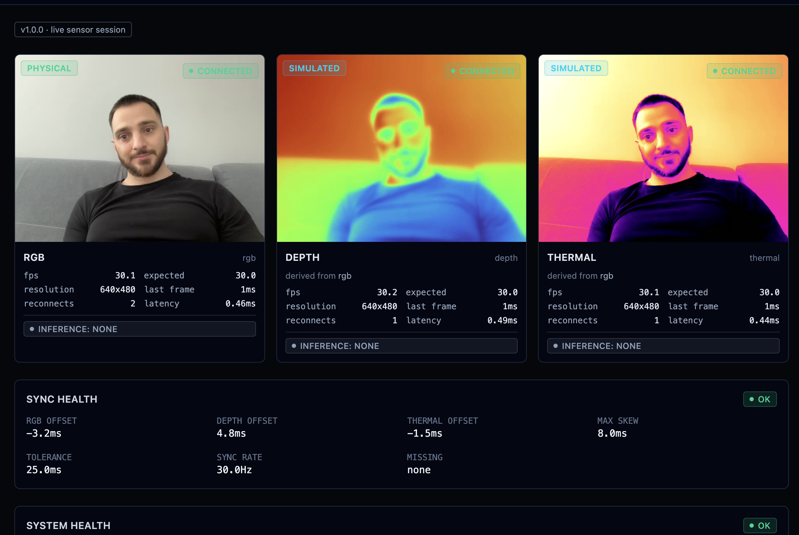
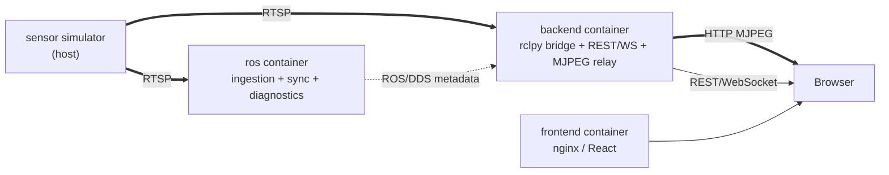
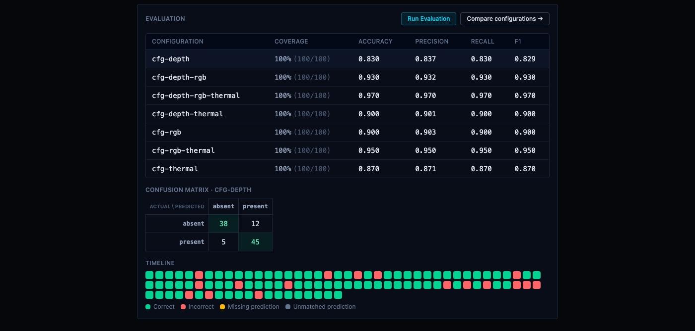

# MultiSens

**An open-source, vendor-neutral platform for ingesting, synchronizing,
diagnosing, evaluating, and visualizing multi-sensor streams** — RGB,
depth, thermal, and whatever else speaks RTSP.

[](https://github.com/CosminBMemetea/multisens/releases/tag/v1.0.0)
[](LICENSE)
[](docs/development.md)
[](ros2_ws)
[](backend)
[](frontend)

Every number MultiSens shows you is either a genuine measurement or an
explicit `unavailable`/`N/A` — never a fabricated one. That rule is not
a tagline; it is enforced end to end, from the ROS diagnostics layer up
through the dashboard, and it's why this README leans on real,
freshly-captured screenshots and verified test counts instead of prose
claims.

<p align="center">
  
  <br>
  <sub>The live dashboard, connected to the reference simulator — one physical webcam feed plus two <code>SIMULATED</code> pseudocolor transforms of it, each truthfully declared as <code>derived_from_sensor_id: rgb</code>, never mistaken for real depth/thermal measurement.</sub>
</p>

## Contents

- [Quick start](#quick-start)
- [What MultiSens is](#what-multisens-is)
- [What MultiSens is NOT](#what-multisens-is-not)
- [Architecture](#architecture)
- [Getting live video in](#getting-live-video-in)
- [Demos](#demos)
- [Docker requirements](#docker-requirements)
- [URLs & API surface](#urls--api-surface)
- [ROS topics](#ros-topics)
- [Known limitations](#known-limitations)
- [Roadmap](#roadmap)
- [Documentation](#documentation)
- [License](#license)

## Quick start

```bash
git clone https://github.com/CosminBMemetea/multisens.git
cd multisens
docker compose up -d
docker compose ps          # ros, backend, frontend should all show "healthy"
open http://localhost:8080 # the dashboard
```

This alone gets the ROS graph, the backend, and the dashboard running —
sensor cards will show `NO SIGNAL` until an RTSP source is pointed at
them (see [Getting live video in](#getting-live-video-in)), and the
evaluation side of the app works immediately without one at all (see
[Demos](#demos)).

## What MultiSens is

| | |
|---|---|
| **Ingestion** | Config-driven RTSP → ROS 2 pipeline. One node type, N sensors, no per-sensor code — add a sensor by editing YAML, not by writing code. |
| **Synchronization** | Real cross-sensor timestamp alignment, with an evidence-based tolerance, not a guessed one. |
| **Diagnostics** | Every field is a genuine measurement or explicit `"unavailable"` — connection state, FPS, sync skew, resource use. |
| **Dashboard** | React dark-UI, live video + full health state, backed by a REST/WebSocket API that never leaks a ROS type to the browser. |
| **Evaluation** (v0.2) | Sessions, scenarios, ground-truth/prediction ingestion from anywhere, timestamp matching, classification metrics — unavailable metrics render `N/A`, never a fabricated zero. |
| **Comparison** (v0.3) | What changed when a sensor was added/removed, reported two ways, with a non-causal validity verdict — *measured differently*, never *caused*. |
| **Requirement profiles & coverage** (v0.4) | Generic hierarchical requirements with open-ended conditions and acceptance criteria against any metric — `PASS`/`FAIL`/`N/A`, every result traceable to its evidence. |
| **Condition exploration** (v0.5) | Filter, group, and cross-tabulate coverage by declared condition — never re-decides `PASS`/`FAIL`/`N/A`, only slices what v0.4 already decided. |
| **Decision support** (v0.6) | Given an explicit caller-supplied policy, which configurations are `SUFFICIENT` — minimum sufficient sets, Pareto/dominance trade-offs, requirement-gap closure. |
| **Resource & deployment trade-offs** (v0.7) | CPU/memory/network/latency/FPS per configuration, every value provenance-tagged `measured`/`declared`/`estimated`/`unavailable`. |
| **Multi-task evaluation** (v0.8) | Object detection (IoU/greedy matching, per-class P/R/F1) and scalar regression (MAE/RMSE/bias) evaluators, evaluator-blind comparison/coverage/decision layers. |
| **Plugin SDK** (v0.9) | Extend with a new sensor, prediction source, evaluator, or resource collector by `pip install`ing an ordinary Python package — no core edits. Verified, not aspirational: a real reference plugin, discovered and running. |
| **Background inference** (v1.0) | A reference YOLOv8n worker + process-isolated bridge plugin demonstrate live, session-bound inference end to end — self-healing connector state, honest staleness detection, zero fabricated `ACTIVE` badges. |

<details>
<summary><b>Full detail per layer, with the exact honesty caveats each one holds itself to</b> (click to expand)</summary>

- A generic, **configuration-driven** RTSP ingestion pipeline on ROS 2
  Humble: one node type, N sensors, no per-sensor code.
- A real **cross-sensor timestamp synchronization** service, with an
  evidence-based tolerance, not a guessed one.
- A **diagnostics system** where every number is either a genuine
  measurement or explicitly `"unavailable"` — never fabricated.
- A **dashboard** (React, dark technical UI) showing live video, connection
  state, FPS, sync skew, and system health, backed by a REST/WebSocket API
  that never leaks a ROS message type to the browser.
- An **evaluation layer** (v0.2): sessions, scenarios, ground-truth and
  prediction ingestion (from anywhere — see
  [What MultiSens is NOT](#what-multisens-is-not)), timestamp matching
  with a configurable tolerance, and classification metrics (accuracy,
  macro/micro precision/recall/F1, a dynamic confusion matrix) — every
  unavailable metric shown as `N/A`, never a fabricated zero. Full
  contract: [docs/evaluation.md](docs/evaluation.md).
- A **configuration comparison layer** (v0.3): what changed when a
  sensor was added or removed, reported two ways (as-persisted and over
  a common matched population), with an evidence-quality validity
  verdict and never a causal claim — "configuration B measured +0.07 F1
  higher than A," never "sensor X caused a +7% improvement." Ablation is
  a comparison view (baseline = the full configuration), not a separate
  concept. Full contract: [docs/comparison.md](docs/comparison.md).
- A **requirement profile / coverage layer** (v0.4): define generic,
  hierarchical requirements with open-ended conditions and acceptance
  criteria (`recall_macro >= 0.90`, `coverage >= 0.95`, ...) against any
  metric v0.2/v0.3 already produce, and see which sensor configurations
  satisfy them — `PASS`/`FAIL`/`N/A` per requirement, coverage and
  evidence-completeness always shown together, every result traceable to
  its exact evidence. No built-in knowledge of any specific requirement
  framework — external users build those with the same generic shapes
  this core exposes. Full contract:
  [docs/profiles.md](docs/profiles.md) /
  [docs/coverage.md](docs/coverage.md).
- A **condition-exploration layer** (v0.5): filter, group, and cross-
  tabulate a profile's already-computed coverage by declared condition
  (`illumination=night`, `occlusion=partial`, ...) — dynamic filter
  controls discovered from the profile itself, a 2D condition cross-tab,
  a failure explorer, an N/A breakdown that distinguishes "no experiment
  performed" from "the evaluation itself has a gap," and full
  requirement-to-evidence traceability. Never re-decides `PASS`/`FAIL`/
  `N/A` and never a causal claim — only slices and counts what v0.4
  already decided. Full contract:
  [docs/condition-explorer.md](docs/condition-explorer.md).
- A **decision-support layer** (v0.6): given an explicit, caller-supplied
  policy (never a default), which sensor configurations are `SUFFICIENT`
  — and is there a smaller one that's tied for sufficient too? Minimum
  sufficient sets by strict set-inclusion minimality (never sensor-count
  sorting, never narrowed to one when several tie), a Pareto/dominance
  trade-off front across sensor count vs. coverage vs. completeness, and
  requirement-gap closure comparing two configurations across four
  separately-exposed transition categories. Sensor removal is reported as
  "removable without violating the current policy" / "policy-critical
  within this configuration" — scoped wording only, never "redundant
  sensor" as an intrinsic property, and never a universal importance
  score. Full contract: [docs/decision-support.md](docs/decision-support.md).
- A **resource observation & deployment trade-off layer** (v0.7): what
  does a sensor configuration actually cost to run — CPU, memory,
  network, latency, FPS — attributed per configuration per session, with
  every value carrying explicit provenance (`measured`/`declared`/
  `estimated`/`unavailable`, never a fabricated number). Joins that
  resource evidence with v0.6's decision evidence into one trade-off
  view: resource constraints (reusing the same acceptance-criterion
  grammar), a resource-aware generalized Pareto front, and observed
  (never causal) resource deltas between two configurations —
  comparability itself gated on matching execution platform, resolution,
  target FPS, and measurement duration. Two independent, non-cabin demo
  families ship with this release — **RideSafe** (70mai front/rear
  dashcams, ride monitoring and incident evidence) and **PropertyWatch**
  (generic home/garage/workshop/storage/small-warehouse multi-camera
  monitoring, no face-recognition or surveillance-identification). Full
  contract: [docs/resources.md](docs/resources.md) /
  [docs/deployment-tradeoffs.md](docs/deployment-tradeoffs.md). Provenance
  discipline across every layer, consolidated in one place:
  [docs/provenance.md](docs/provenance.md).
- Built to work identically whether a stream comes from the reference
  webcam simulator, a real sensor, or a gateway that happens to speak RTSP.
- **A plugin SDK for external integration** (v0.9): MultiSens can be
  extended with a new sensor, prediction/ground-truth source, evaluator,
  or resource-telemetry integration by installing an ordinary Python
  package and restarting - no MultiSens core code edited. This is a
  verified claim, not an aspirational one: a real independently-installable
  reference plugin (`examples/plugins/environment-sensor/`) was installed
  into a genuinely clean Python virtualenv with zero MultiSens tooling and
  discovered correctly; a second, robotics-flavored pair of test plugins
  (synthetic LiDAR/IMU connectors) proved the same SDK against a
  non-camera domain; and a real Docker image rebuilt with the reference
  plugin `pip install`ed on top discovered all 6 plugins (3 built-in
  evaluators, the built-in RTSP connector, both example plugins)
  correctly at boot. Plugins are **trusted local software** with the full
  permissions of the backend process - see
  [What MultiSens is NOT](#what-multisens-is-not) and
  [docs/plugin-sdk.md](docs/plugin-sdk.md).
- **Live, process-isolated background inference** (v1.0.0): MultiSens
  still produces zero predictions itself by design, but a reference
  YOLOv8n inference worker plus a thin, process-isolated bridge plugin
  now demonstrate the whole background-inference path end to end —
  session-bound wiring, live dashboard status (`ACTIVE`/`NONE`/`ERROR`
  with real measured predictions/sec and honest staleness detection), and
  a self-healing connector state machine that survives a worker restart,
  a sensor disconnect, or a stale-but-still-responding input, all without
  restarting the session itself. See [Roadmap](#roadmap) and
  [docs/limitations.md](docs/limitations.md#live-verified-failurerecovery--multi-sensor-matrix-v10-rc-issue-125)
  for the exact live-verification evidence.

</details>

## What MultiSens is NOT

- **Not a perception or ML platform.** No inference, no object
  detection, no "compliant"/"certified"/"safety score" claim anywhere
  in the core UI. MultiSens evaluates predictions; it does not produce
  them (the v1.0.0 reference inference worker is an optional, external,
  opt-in example, never something the core depends on). A prediction may
  come from ROS, REST, an imported file, another computer, or
  proprietary software, and MultiSens doesn't need to know which.
- **Not a sensor-fusion tool, and not a causal-attribution tool.**
  Comparisons, condition exploration, decision support, and resource
  deltas all report what was *measured*, never what *caused* it — no
  universal sensor-importance score anywhere.
- **Evaluation is classification + object detection + regression only**
  (v0.2/v0.8) — no tracking, segmentation, pose, or AP/mAP.
- **Not tied to any vendor, OEM, or dataset.** No proprietary
  integration, no hardcoded sensor brand.
- **Not a production-hardened, multi-user, authenticated service.**
  CORS is wide open, there's no auth, single local dashboard user —
  deliberate scope, not oversights.
- **Not RViz or Foxglove.** Those remain valid developer tools for the
  raw ROS graph; MultiSens's dashboard is the product UI.
- **Not a sandboxed plugin platform (v0.9).** A plugin runs with the
  full permissions of the backend process — no seccomp, no per-plugin
  isolation. Only install plugins you trust as much as MultiSens itself.

<details>
<summary><b>Full detail, with exact doc references</b> (click to expand)</summary>

- **Not a perception or ML platform.** No inference, no object
  detection, no "compliant"/"certified"/"safety score" claim anywhere
  in the UI. MultiSens evaluates predictions; it does not
  produce them — a prediction may come from ROS, REST, an imported file,
  another computer, or proprietary software, and MultiSens doesn't need
  to know which. v0.4's requirement profiles judge caller-defined
  acceptance criteria against evidence — a different, narrower claim
  than any compliance framework's, and one an external user's profile
  document carries, not the MultiSens core. See
  [docs/profiles.md](docs/profiles.md#what-this-layer-answers).
- **Not a sensor-fusion tool, and not a causal-attribution tool.**
  MultiSens never runs fusion algorithms, and v0.3's comparison layer
  never claims a sensor *caused* a change — only that two configurations
  *measured* differently under stated conditions. v0.5's condition
  explorer carries the same discipline forward: "observed coverage under
  condition X," never "X caused this outcome." v0.6's decision-support
  layer extends it once more: a sensor is "removable without violating
  the current policy" or "policy-critical within this configuration" —
  never "redundant" or "necessary" as an intrinsic property, and there is
  no universal sensor-importance score anywhere. v0.7's resource deltas
  keep the same posture: "candidate used +5.1 Mbps more than baseline,"
  never "the added sensor cost 5.1 Mbps" — and there is no combined
  decision+resource score anywhere either. See
  [docs/comparison.md](docs/comparison.md#non-causal-by-design).
- **Evaluation is classification/detection/regression only** (v0.2/v0.8)
  — the domain model is deliberately generic (see
  [docs/evaluation.md](docs/evaluation.md#task-values-generic-by-design)),
  but no tracking, segmentation, pose, or AP/mAP engine exists.
- **Not tied to any vendor, OEM, or dataset.** No proprietary integration,
  no hardcoded sensor brand, no code specific to the reference simulator
  anywhere outside its own config entry.
- **Not a production-hardened, multi-user, authenticated service.** CORS is
  wide open, there's no auth, and it assumes a single local dashboard user —
  all deliberate scope, not oversights. See
  [docs/limitations.md](docs/limitations.md).
- **Not RViz or Foxglove.** Those remain valid developer tools for
  inspecting the ROS graph directly; MultiSens's dashboard is the product
  UI, and doesn't depend on either.
- **Not a sandboxed plugin platform (v0.9).** A plugin executes with the
  full permissions of the backend process — filesystem, network,
  environment variables, everything. There is no seccomp, no separate OS
  user, no per-plugin container isolation. Installing a plugin is
  equivalent to installing any other Python package into this
  environment: only install plugins you trust as much as you trust
  MultiSens itself. See
  [docs/plugin-sdk.md#trust-model](docs/plugin-sdk.md#trust-model).

</details>

## Architecture

Three containers, one host-side simulator that's explicitly *not* part of
MultiSens:



Four boundaries, each carrying exactly one kind of traffic — video and
metadata never share a transport, and ROS/DDS never talks to the browser
directly. Full diagram, container topology rationale, and the measured
evidence behind each major decision: [docs/architecture.md](docs/architecture.md).

## Getting live video in

MultiSens ingests from RTSP; it does not produce sensor data itself. For
local development, the reference simulator is a separate repository:
[`multirtsp`](https://github.com/CosminBMemetea/multirtsp) — one MacBook
webcam, split via `ffmpeg` into three RTSP paths (`rgb`, `depth`, `thermal`)
served by MediaMTX. Start it before `docker compose up`:

```bash
# from a checkout of https://github.com/CosminBMemetea/multirtsp
mediamtx ./mediamtx.yml
./stream_macos.sh
```

Nothing in MultiSens's core code (`ros2_ws/`, `backend/`, `frontend/`)
references this simulator — the only place it appears is as URLs in
`config/sensors.yaml`. Point that file at real sensors and the simulator is
never needed.

**Physical vs. simulated — a hard distinction.** Every sensor in
`config/sensors.yaml` declares `source_type: physical` or `simulated`,
and that value flows untouched through diagnostics, the ROS graph, and
the dashboard's badges (visible in the screenshot above). In the
reference setup, `depth`/`thermal` are FFmpeg `pseudocolor` transforms
of the `rgb` feed — visually similar to real output, but never claimed
to be a physical measurement, and truthfully linked back via
`derived_from_sensor_id` (v1.0.0). See
[docs/connector-api.md](docs/connector-api.md) for the full config
schema.

## Demos

Every demo loads a deterministic, clearly-labeled **synthetic** dataset
through the ordinary REST API — none of these represent real sensor
performance, and each script prints the exact URL to open when it
finishes. Run `docker compose up -d` once, then any subset of:

| Demo | Shows | Load script |
|---|---|---|
| Classification (v0.2) | Accuracy/precision/recall/F1, confusion matrix, timeline — 7 configurations forming a clean lattice | `scripts/load_demo_data.py` |
| Comparison (v0.3) | Sensor addition/removal deltas, ablation, non-causal validity verdicts — open [`/comparison`](http://localhost:8080/comparison) after loading the demo above | *(same dataset)* |
| Requirement coverage + exploration (v0.4/v0.5) | 8 requirements × 6 sessions across illumination/occlusion/weather, 25–100% coverage by construction | `scripts/load_profile_demo_data.py` |
| Decision support (v0.6) | 8 configurations, minimum sufficient set, 4-point Pareto front, gap analysis | `scripts/load_decision_demo_data.py` |
| RideSafe / PropertyWatch trade-offs (v0.7) | Resource cost vs. coverage — front/rear dashcam and a 3-camera Pareto staircase | `scripts/load_ridesafe_demo_data.py`, `scripts/load_propertywatch_demo_data.py` |
| Object detection (v0.8) | Per-class precision/recall/F1/IoU on RideSafe front/rear and PropertyWatch's 3 cameras | `scripts/load_ridesafe_detection_demo_data.py`, `scripts/load_propertywatch_detection_demo_data.py` |
| Robot/Drone (v0.8) | Detection + regression evaluators on a synthetic mobile-robot platform | `scripts/load_robot_drone_demo_data.py` |

<p align="center">
  
  <br>
  <sub>One session, seven configurations, one confusion matrix, one per-sample timeline — every number traceable back to the raw ground-truth/prediction pair that produced it.</sub>
</p>

Full derivation for every synthetic dataset above (exactly how each
number was constructed, not measured):
[examples/profiles/README.md](examples/profiles/README.md) /
[examples/evaluation/README.md](examples/evaluation/README.md).

Want to see the v1.0.0 live-inference path (a real YOLOv8n worker,
process-isolated, self-healing on failure) running end to end on your
own machine? Full copy-pasteable walkthrough in
[docs/development.md](docs/development.md).

## Docker requirements

- Docker Desktop. Developed and verified with 6GB RAM / 7 CPU allocated to
  the VM on an Apple Silicon (M2) host — base images confirmed multi-arch
  (arm64/v8), no architecture-specific code.
- Nothing else on the host required. The frontend builds entirely inside
  its own Docker multi-stage build; Node/npm locally is only useful for
  faster dev iteration (`cd frontend && npm run dev`), never required for
  `docker compose up`.
- See [docs/configuration.md](docs/configuration.md) for every environment
  variable, port, and volume mount `docker-compose.yml` uses.

## URLs & API surface

| What | URL |
|---|---|
| Dashboard | http://localhost:8080 |
| Sessions / Evaluation (v0.2) | http://localhost:8080/sessions |
| Comparison (v0.3) | http://localhost:8080/comparison |
| Profiles / Coverage (v0.4) | http://localhost:8080/profiles |
| Integrations (v0.9) | http://localhost:8080/integrations |
| Backend REST | http://localhost:8000/api/* |
| Backend WebSocket | ws://localhost:8000/ws/status |
| MJPEG video (per sensor) | http://localhost:8000/api/sensors/{id}/stream.mjpeg |

Full API surface, one link per layer:
[ingestion](docs/connector-api.md#backend-api-surface-for-building-an-alternative-frontend-or-scripting) ·
[evaluation](docs/evaluation.md#api-surface) ·
[comparison](docs/comparison.md#api-surface) ·
[profiles](docs/profiles.md#api-surface) /
[coverage](docs/coverage.md#api-surface) ·
[decision support](docs/decision-support.md#api-surface) ·
[resources](docs/resources.md#api-surface) ·
[trade-offs](docs/deployment-tradeoffs.md#api-surface).

## ROS topics

| Topic | Type |
|---|---|
| `/multisens/sensors/{sensor_id}/image_raw` | `sensor_msgs/Image` |
| `/multisens/sensors/{sensor_id}/frame_stamp` | `sensor_msgs/TimeReference` |
| `/multisens/diagnostics` | `diagnostic_msgs/DiagnosticArray` |
| `/multisens/sync/status` | `diagnostic_msgs/DiagnosticArray` |

No custom `.msg` files anywhere in this repo. Full contract, QoS, and every
diagnostic field's meaning: [docs/topics.md](docs/topics.md).

## Known limitations

The authoritative, current list — scope boundaries, environment-specific
assumptions, and honestly-reported gaps (no CI yet, soak testing is real
but time-bounded, single-dashboard-user scale only) — lives in
[docs/limitations.md](docs/limitations.md), not duplicated here since it
changes independently of this README.

## Roadmap

Each release built directly on the last; nothing here was re-architected
away in a later version.

| Version | Headline | Full detail |
|---|---|---|
| v0.1 | Ingestion, synchronization, diagnostics, visualization | [docs/topics.md](docs/topics.md) |
| v0.2 | Evaluation core — sessions, matching, classification metrics | [docs/evaluation.md](docs/evaluation.md) |
| v0.3 | Configuration comparison, non-causal validity verdicts | [docs/comparison.md](docs/comparison.md) |
| v0.4 | Requirement profiles & coverage | [docs/profiles.md](docs/profiles.md) / [docs/coverage.md](docs/coverage.md) |
| v0.5 | Condition exploration, failure/N/A analysis | [docs/condition-explorer.md](docs/condition-explorer.md) |
| v0.6 | Decision support — sufficiency, minimum sets, Pareto | [docs/decision-support.md](docs/decision-support.md) |
| v0.7 | Resource observation & deployment trade-offs | [docs/resources.md](docs/resources.md) / [docs/deployment-tradeoffs.md](docs/deployment-tradeoffs.md) |
| v0.8 | Object detection & regression evaluators | [docs/evaluators.md](docs/evaluators.md) |
| v0.9 | Plugin SDK — external integration via `pip install` | [docs/plugin-sdk.md](docs/plugin-sdk.md) |
| **v1.0.0** | **`sensor_id`-keyed topics + live, self-healing background inference** | [docs/limitations.md](docs/limitations.md#live-verified-failurerecovery--multi-sensor-matrix-v10-rc-issue-125) |

v1.0.0 closed the two gaps the v0.9 architecture surfaced: sensor
identity was keyed by `modality` (two same-modality live cameras
collided on one topic) — topics are now keyed by a required-unique
`sensor_id`, live-verified with two simultaneous RTSP-replayed RGB
feeds. And a reference YOLOv8n inference worker plus a thin,
process-isolated bridge plugin demonstrate the whole background-
inference path end to end — session-bound wiring, live dashboard status
with real measured predictions/sec, and a connector state machine that
self-heals from a worker restart, a sensor disconnect, or a
stale-but-still-responding input, all without restarting the session.
A four-sensor configuration and both failure modes were killed and
independently recovered on the real stack, not simulated.

Not yet built, deliberately: sensor fusion, causal/statistical claims,
tracking/segmentation/pose evaluators, AP/mAP, per-requirement weighted
aggregation, cost/power/latency decision objectives, GPU resource
metrics, cross-platform resource comparison, authentication, cloud
deployment. Full list with reasoning:
[docs/limitations.md](docs/limitations.md). Everything that shipped,
how it was verified: [CHANGELOG.md](CHANGELOG.md).

## Documentation

**Core**
- [docs/architecture.md](docs/architecture.md) — system design and the reasoning behind it
- [docs/topics.md](docs/topics.md) — ROS topic/message contract
- [docs/configuration.md](docs/configuration.md) — every config surface
- [docs/diagnostics.md](docs/diagnostics.md) — how to read the health model
- [docs/connector-api.md](docs/connector-api.md) — adding a sensor, backend API
- [docs/development.md](docs/development.md) — repo layout, tests, dev workflow, the full v1.0.0 live-inference walkthrough

**Evaluation layers**
- [docs/evaluation.md](docs/evaluation.md) — domain model, matching, metrics, API (v0.2)
- [docs/comparison.md](docs/comparison.md) — validity semantics, ambiguity handling, API (v0.3)
- [docs/profiles.md](docs/profiles.md) / [docs/coverage.md](docs/coverage.md) — requirements, evidence selection, coverage aggregation (v0.4)
- [docs/condition-explorer.md](docs/condition-explorer.md) — filtering, faceting, failure/N/A exploration (v0.5)
- [docs/decision-support.md](docs/decision-support.md) — policy model, sufficiency, Pareto/dominance (v0.6)
- [docs/resources.md](docs/resources.md) / [docs/deployment-tradeoffs.md](docs/deployment-tradeoffs.md) — resource provenance, trade-off engine (v0.7)
- [docs/evaluators.md](docs/evaluators.md) — generic `Evaluator` interface & registry (v0.8)
- [docs/detection-evaluation.md](docs/detection-evaluation.md) — bbox convention, IoU, greedy matching (v0.8)
- [docs/regression-evaluation.md](docs/regression-evaluation.md) — scalar value/unit schema, MAE/RMSE (v0.8)
- [docs/provenance.md](docs/provenance.md) — the evidence-honesty discipline every layer above shares

**Extensibility & release history**
- [docs/plugin-sdk.md](docs/plugin-sdk.md) — the `multisens_sdk` package, discovery, connector lifecycle, trust model, v1.0.0's live-inference reference plugin
- [docs/limitations.md](docs/limitations.md) — what MultiSens doesn't do, and why
- [CHANGELOG.md](CHANGELOG.md) — what shipped, what was fixed, verified how

## License

Apache-2.0 — see [LICENSE](LICENSE).
