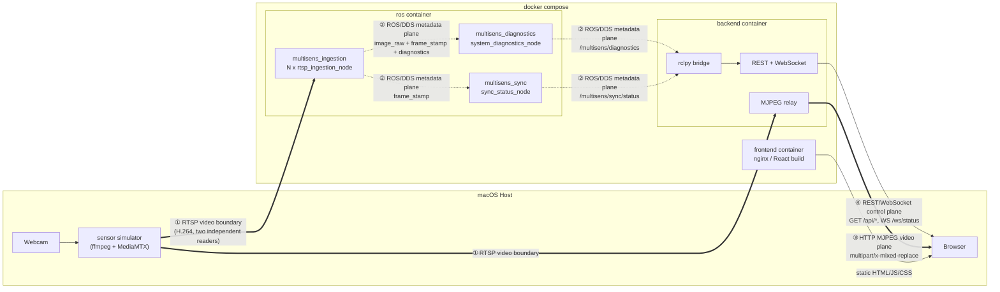

# MultiSens Architecture

This is the authoritative architecture reference. The main [README](../README.md)
has the project pitch, phase-by-phase development log, and quick start; this
document is the standing "how does it actually work and why" reference.

## System overview

Four distinct boundaries, each carrying only one kind of traffic - this is
the single most important thing to take from this diagram. Video and
metadata never share a transport; ROS/DDS and the browser never talk
directly.



**① RTSP video boundary** - the actual integration boundary between
MultiSens and any sensor source, physical or simulated. Two independent
readers of the same URL: the ROS ingestion node (for metadata/sync) and the
backend's video relay (for the browser) - neither depends on the other.

**② ROS/DDS metadata plane** - small messages only (headers, diagnostic
key/value pairs). Never carries pixels across this boundary.

**③ HTTP MJPEG video plane** - pixels reach the browser here, entirely
independent of ROS/DDS. Still alive even if the `ros` container is down.

**④ REST/WebSocket control/diagnostic plane** - the browser's only source
of truth for diagnostics/sync state, and it's plain JSON: no ROS message
type crosses this boundary, translated once inside `ros_bridge.py`.

Three containers (`ros`, `backend`, `frontend`), one host-side simulator that
is explicitly **not** part of MultiSens - the RTSP endpoints it produces are
the integration boundary. Nothing in this codebase depends on the simulator
existing; a real depth or thermal camera speaking RTSP works identically.

## Container topology, and why it's three containers, not more or fewer

Decided in the Phase 0 architecture review, before any code existed, and
held through all nine phases:

- **`ros`** bundles ingestion (N nodes, one per configured sensor),
  diagnostics, and synchronization into one image/container. These are
  separate OS processes (see [Fault isolation](#fault-isolation-and-respawn)
  below) but one Docker service - for an early-stage project on an 8GB-class
  machine, splitting them into separate containers would have added
  networking/deployment overhead with no concrete benefit at this scale.
- **`backend`** is a genuinely separate container from `ros`, because it has
  a different failure/restart domain (web-facing, should be restartable
  without disturbing sensor ingestion) and a different dependency footprint
  (FastAPI/uvicorn, not needed by the ROS graph).
- **`frontend`** deliberately did *not* join `docker-compose.yml` until
  Phase 7, once there was an actual UI to serve - not carried as an empty
  container through Phases 1-6.

## Evaluation layer (v0.2) - inside `backend`, not a new service

Session/scenario management, prediction/ground-truth ingestion, and the
matching+metrics engine (Phase 10 onward) are a new domain living
entirely inside the existing `backend` container - no new service, no
new inter-container boundary. The same "avoid ceremony" review that
shaped v0.1's three-container topology applied here: a separate
evaluation microservice was considered and rejected, since nothing about
the workload (SQLite reads/writes, in-process metric computation) needs
isolation from the REST/WebSocket/MJPEG code already running there.

Internally, `backend/app/` is layered to keep that decision reversible
later without a rewrite:

```
domain/        pure Python - models, matching, metrics. Zero fastapi/
               sqlite3/rclpy imports, verified by every phase that
               touched it.
persistence/   the only code that imports sqlite3 (repository.py, db.py).
api/           FastAPI routers - the only code that imports fastapi
               for this layer. Translates HTTP <-> domain objects,
               same role ros_bridge.py plays for ROS <-> HTTP.
```

Full contract (domain model, matching algorithm, metric semantics, API
surface, persistence): [evaluation.md](evaluation.md).

## The two planes: control/telemetry vs. video

This is the single most consequential architecture decision in the project,
made in the Phase 0 review and validated with real measurements in Phase 2
and again in Phase 6:

- **Control/telemetry plane**: ROS 2 (DDS) carries only small messages -
  diagnostics, sync status, timestamps. `backend`'s embedded `rclpy` node
  subscribes to these, translates them into plain JSON (see
  [`ros_bridge.py`](../backend/app/ros_bridge.py) - the *only* file in the
  backend that imports a ROS message type), and pushes them to the browser
  over a WebSocket.
- **Video plane**: never touches ROS/DDS. `backend`'s `video_relay.py` opens
  its own, independent RTSP connection directly to the same source
  `rtsp_ingestion_node` reads, and transcodes to MJPEG via ffmpeg's `mpjpeg`
  muxer for the browser's `` tags.

**Why**: measured directly (Phase 2) that a generic `rclpy` subscriber
processing a single raw 640x480 `bgr8` image topic (~900KB/frame) at 30fps
could not keep up - the publish side stayed a steady 30fps the whole time,
the shortfall was entirely in a second subscriber trying to consume the same
stream. Routing browser video through ROS would mean re-encoding an
already-struggling stream on top of that. Keeping video on its own path
means the dashboard's video never competes with, or is limited by, ROS/DDS
throughput - and still works even if the `ros` container is down.

This same "large message defeats a generic subscriber" problem resurfaced
in Phase 5 when `multisens_sync` needed frame timestamps at full rate: fixed
by adding a companion `sensor_msgs/TimeReference` topic
(`/multisens/sensors/{sensor_id}/frame_stamp`) carrying only the header, no
pixels - see [topics.md](topics.md).

**v0.9 note**: the Plugin SDK's own data-plane/control-plane split
(external sensor/prediction/ground-truth/resource connectors) extends
this exact decision rather than reinventing it - see
[plugin-sdk.md](plugin-sdk.md#data-plane-vs-control-plane).

## No custom ROS messages

`sensor_msgs/Image`, `sensor_msgs/CameraInfo` (declared, not yet populated -
no calibration data exists for simulated sources, and none is fabricated),
`sensor_msgs/TimeReference`, and `diagnostic_msgs/DiagnosticArray` cover
everything v0.1 needs. `DiagnosticArray`'s `KeyValue` list is what makes this
possible - it's designed for exactly this: arbitrary named fields (fps,
resolution, offsets, connection state) that don't have dedicated fields in
any single standard message type. Full field reference in
[topics.md](topics.md).

## Diagnostics: self-reported, not externally inferred

Per-sensor diagnostics (`connection_state`, `reconnect_count`,
`resolution`, `encoding`) are published by `rtsp_ingestion_node` itself, not
computed by a separate node watching the image topic - a passive external
subscriber can only guess at connection state from message-arrival gaps,
which conflates "never connected," "reconnecting," and "genuinely offline."
Only the node that owns the RTSP connection knows the difference.

*Global* diagnostics (CPU/RAM/uptime/connected-sensor-count) are the
opposite case: no single sensor owns them, so `multisens_diagnostics`
(`system_diagnostics_node`) is a separate node that aggregates by listening
to `/multisens/diagnostics` itself.

## Synchronization: measured, not guessed

`multisens_sync` uses `message_filters.ApproximateTimeSynchronizer` - ROS's
standard mechanism for matching messages across topics by timestamp
proximity - rather than hand-rolled frame-matching logic. It compares each
sensor's **ROS publish timestamp** (set by `rtsp_ingestion_node`'s own clock
at the moment it publishes), not a source capture timestamp: RTSP/H.264
doesn't reliably provide one across independently-read streams, and this
project does not pretend otherwise.

The default tolerance (`tolerance_ms=25.0`) came from a real measurement,
not a guess: real cross-sensor skew on the reference simulator setup (one
physical camera, one `ffmpeg` process, three independently-read RTSP
sessions) was consistently 0.2-3.5ms across repeated samples. This is a
favorable, co-located case - a physically separate/networked sensor rig
would likely show more real skew, and this default should be revisited
against real hardware before being trusted there.

## Fault isolation and respawn

Each `rtsp_ingestion_node` handles its own **RTSP connection** dying:
detects a failed read, releases the capture handle, retries every 2s.
Verified extensively (Phases 2-8) including under a real webcam-process
kill/restart cycle.

That is a different failure mode from the node's own **OS process** dying
(crash, OOM-kill, `kill -9`) - a dead process can't run its own recovery
code. Phase 8 found this gap by testing it directly (killing exactly one of
three sibling ingestion processes, confirming the other two were
completely unaffected) and closed it with `respawn=True` on every `Node`
action in [`ingestion.launch.py`](../ros2_ws/src/multisens_ingestion/launch/ingestion.launch.py)
- ROS 2 launch's own standard mechanism, not a custom supervisor.

## Config-driven, not hardcoded

One generic `rtsp_ingestion_node` type, instantiated N times from
[`config/sensors.yaml`](../config/sensors.yaml) by
[`ingestion.launch.py`](../ros2_ws/src/multisens_ingestion/launch/ingestion.launch.py),
which reads the config file itself at launch-description-generation time
(plain Python + PyYAML, not a launch argument - the sensor *count* has to be
known before the list of `Node` actions can be built, and a launch
argument's value isn't resolved until launch execution). Adding a fourth
sensor is a config entry, not a code change - see
[connector-api.md](connector-api.md).

## Known limitations (v0.1, deliberate)

- ~~One sensor per modality~~ **Resolved, v1.0-RC (issue #121).** Topics
  are keyed by `sensor_id` (`/multisens/sensors/{sensor_id}/image_raw`),
  not modality - two RGB cameras (different ids, same `modality: rgb`) no
  longer collide. `sensor_config.py`'s launch-time guard now rejects a
  duplicate *id*, not a duplicate modality. Live-verified with the real
  RideSafe recorded front/rear RTSP replay: both `ridesafe_front_rgb`/
  `ridesafe_rear_rgb` connected simultaneously, `sync_status_node` reported
  `offset_ms_ridesafe_front_rgb`/`offset_ms_ridesafe_rear_rgb` independently,
  "synchronized within 25ms tolerance." Reference config (`id == modality`
  for `rgb`/`depth`/`thermal`) produces byte-identical topic/node names to
  before - confirmed, not assumed.
- **MJPEG relay is one ffmpeg subprocess per HTTP client**, not fanned out
  across multiple simultaneous viewers of the same sensor. Fine for a single
  dashboard; would need a shared-broadcast design for multiple concurrent
  viewers.
- **CORS is wide open** (`allow_origins=["*"]`) on the backend - a
  deliberate choice for a local-only v0.1 tool with no auth or cookies, not
  something to carry into any deployment reachable beyond localhost.
- **`/multisens/sync/frames`** (actual grouped/republished synchronized
  frame bundles, as opposed to status *about* synchronization) is out of
  scope for v0.1.
- **`host.docker.internal`** dependency ties the default `config/sensors.yaml`
  to Docker Desktop for Mac; confirmed empirically that it reaches even a
  loopback-bound host service, which would *not* work unmodified on plain
  Linux Docker.
- **No CI.** Nothing is claimed as verified without having actually been
  run - see the README's phase-by-phase log for exactly what was checked -
  but there is no automated regression coverage yet.

## Portability

Developed on Apple Silicon (M2, 8GB target machine) against
`ros:humble-ros-base`, which publishes an arm64/v8 manifest - confirmed, not
assumed, in the Phase 0 environment check. The core (`ros2_ws/`, `backend/`)
has no macOS-specific code; the only host-specific piece is
`host.docker.internal` in the default `config/sensors.yaml`, which is a
config value, not a code path. Moving to Linux x86_64 or a Jetson means
changing sensor URLs in config, not touching the ingestion/diagnostics/sync/
backend code.
