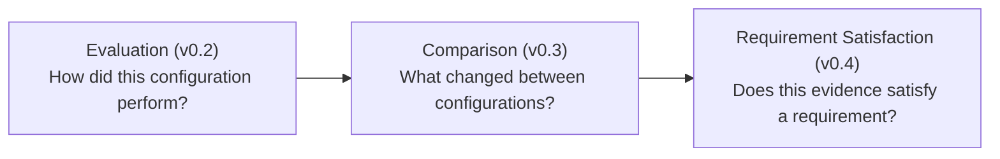

# Comparison Contract (v0.3, generalized across evaluator types in v0.8)

The authoritative reference for MultiSens's configuration-comparison
layer: the domain model, evidence semantics, ambiguity handling, the API
surface, and the frontend. See [evaluation.md](evaluation.md) for the
layer this one is built on top of, [profiles.md](profiles.md)/
[coverage.md](coverage.md) for the requirement-profile layer (v0.4)
built on top of *this* one — reusing this layer's exact multi-source
ambiguity rule rather than reinventing it —
[condition-explorer.md](condition-explorer.md) for the v0.5 condition-
exploration layer built on top of that one,
[decision-support.md](decision-support.md) for the v0.6 layer whose
sensor-addition analysis reuses this layer's exact `classify_relationship`
set-difference rather than reimplementing it, and
[limitations.md](limitations.md) for what this layer deliberately
doesn't do.

## What this layer answers

> What changed when I added or removed a sensor?

Not: *"Is configuration B better than configuration A?"* in some
absolute sense, and never: *"Sensor X caused a +7% improvement."*
Comparison reports **what measured differently**, never **why** — see
[Non-causal by design](#non-causal-by-design) below. It's the second of
three deliberately separate evidence layers this project keeps distinct:



## Non-causal by design

Every field, function, and UI copy choice in this layer deliberately
avoids implying causality. `ComparisonValidity` is an **evidence-quality**
verdict (is this comparison methodologically fair — same evidence,
adequate common population), never a claim that either configuration is
"good enough" for any purpose, and never a statistical claim (no
p-values, no confidence intervals — see
[limitations.md](limitations.md)). `relationship` distinguishes a
single-sensor change (`direct_addition`/`direct_removal` — the closest
thing to attributable evidence this project will ever produce) from a
general multi-sensor difference (`general` — evidence the two
configurations differ, nothing more).

## Domain model

Defined in
[`backend/app/domain/models.py`](../backend/app/domain/models.py)
(shapes) and
[`backend/app/domain/comparison.py`](../backend/app/domain/comparison.py)
(the pure computation engine) — same zero-`fastapi`/`sqlite3`/`rclpy`-import
discipline as `matching.py`/`metrics.py`.

- **`MetricDelta`** — `baseline`, `candidate`, `absolute` (`candidate -
  baseline`, `None` if either side is `None`), `relative` (`absolute /
  abs(baseline)`, `None` if `baseline` is `None` **or zero** — never a
  `ZeroDivisionError`, and never silently coerced to `0.0`).
- **`ComparisonMetrics`** — `sample_count`, `matched_samples`,
  `unmatched_predictions`, `unmatched_ground_truth`, `coverage`
  (`matched_samples / sample_count`, `None` if `sample_count` is 0),
  `metrics` (dict of `str -> float | None`).
- **`ComparisonSide`** — one of the two ways to compare a baseline/
  candidate pair (see [Reported vs. common-set](#reported-vs-common-set)
  below): `baseline`/`candidate` (`ComparisonMetrics`), `metric_deltas`
  (dict of `MetricDelta`), `coverage_delta_pp` (**percentage points**,
  `(candidate.coverage - baseline.coverage) * 100` — never a relative
  percentage of coverage, a different and easily-confused quantity),
  `matched_sample_delta`, `common_sample_count` (only meaningful on the
  `common_set` side).
- **`PairwiseComparison`** — `session_id`, `task`,
  `baseline_configuration_id`/`candidate_configuration_id`,
  `baseline_source_id`/`candidate_source_id` (resolved, never guessed —
  see [Multi-source ambiguity](#multi-source-prediction-ambiguity)),
  `tolerance_ms`, `added_sensors`/`removed_sensors` (read from real
  `Prediction.sensor_ids` rows, never parsed out of a `configuration_id`
  string — that string isn't safe to reverse-parse, see
  [evaluation.md](evaluation.md#configuration_id-is-derived-never-chosen)),
  `relationship`, `reported`, `common_set`, `validity`, `computed_at`.

### No `Experiment` entity

Considered and rejected. A comparison request's own fields (session,
task, baseline, candidates) already are what an `Experiment` would hold;
persisting a second copy of that shape would only add a place for it to
drift from the request that actually ran.

### No persistence

Every `/compare` call recomputes fresh from already-persisted
`EvaluationResult`/`GroundTruth`/`Prediction` rows — no new table, no
migration. Same reasoning as the `Experiment` decision: the underlying
evidence is already durable and cheap to re-derive from at this
project's target scale.

## Reported vs. common-set

Always computed **together** — there is no caller-selected `mode`. Two
different questions about the same pair:

- **`reported`** — diffs the two already-persisted `EvaluationResult`s
  exactly as computed (each side may have used a different
  `tolerance_ms`).
- **`common_set`** — filters both configurations' already-matched pairs
  down to the ground-truth **ids** both matched, then re-evaluates each
  side over exactly that shared population using whichever evaluator
  actually produced the two persisted results, dispatched through
  `EVALUATOR_REGISTRY` (v0.8 — read straight off each side's own
  `EvaluationResult.evaluator_type`, never assumed or re-requested; see
  [evaluators.md](evaluators.md)). Filtering is by `GroundTruth.id` on the
  already-computed match, **never** by re-running `match_by_timestamp` on
  a subset — a subset re-match isn't guaranteed to reproduce the pairs
  the original full-population match found, if two ground-truth points
  had been competing for the same prediction. Everything in this filtered
  view is matched by construction, so common-set coverage is always
  100%; `common_sample_count` (relative to each side's own unfiltered
  `matched_samples`) is the number that actually matters — for detection
  this counts shared matched **frames**, not shared matched objects (see
  [detection-evaluation.md](detection-evaluation.md#evaluatoroutputs-frame-count-fields-stay-frame-level-not-object-level));
  for regression one matched pair already is one sample, so there is no
  analogous frame-vs-object distinction to make (see
  [regression-evaluation.md](regression-evaluation.md#evaluatoroutputs-frame-count-fields)).

## Generic across evaluator types (v0.8)

`ComparisonSide.metric_deltas` is built from whatever metric keys the
two `ComparisonMetrics` actually have (`sorted(set(baseline.metrics) |
set(candidate.metrics))`), never a hardcoded classification field list —
the same delta machinery works unchanged for `object_detection`'s
precision/recall/F1/TP/FP/FN/mean-IoU or `regression`'s
MAE/RMSE/bias/median, zero new comparison code required for either
evaluator. `compute_metric_delta` already treats a `None` baseline or
candidate as a genuine "no evidence" case (absolute/relative both stay
`None`, never fabricated) — proven not just at the pure-function level
but through the real HTTP/JSON response for a zero-evidence detection
configuration (`test_compare_detection_with_all_na_metrics_on_one_side_does_not_crash`,
Phase 90).

**A baseline/candidate pair evaluated with different `evaluator_type`s
is an explicit `invalid` comparison** — there is nothing meaningful to
diff between, say, a classification accuracy and a regression MAE. This
is reported as a dedicated `ComparisonValidity` reason
(`"...evaluator_type..."`), the common population size is still honestly
reported via frame count, but no metric deltas are fabricated across the
mismatch. The frontend never branches on evaluator type either —
`ComparisonMetricTable`/`Comparison.tsx`'s leaderboard both render
whatever metric keys `metric_deltas` actually contains, with
`labelForMetric` (`frontend/src/format.ts`) providing a friendly label
for every known metric name across all three evaluators and a raw-key
fallback for anything else.

`CompareRequest.parameters` (v0.8) threads through to the common-set
re-evaluation exactly like `tolerance_ms` already does — required for an
`object_detection` comparison (no default confidence/IoU threshold, same
as `/evaluate`), ignored by classification/regression. A real bug this
project caught before shipping: the common-set path used to call
`evaluate(match_result, {})` unconditionally, crashing any
`object_detection` comparison with an unhandled `500` until this field
was added (Phase 84) — now a clean `422` if `parameters` is omitted for
a detection comparison.

## Sensor-set relationship

[`classify_relationship`](../backend/app/domain/comparison.py) — pure
`set` difference on `sensor_ids`, nothing more:

```python
added = candidate_set - baseline_set
removed = baseline_set - candidate_set
# direct_addition: len(added) == 1 and not removed
# direct_removal:  len(removed) == 1 and not added
# general: everything else - swaps, multi-sensor jumps, self-comparison
```

**Ablation is not a separate concept or endpoint.** It's `/compare`
called with the baseline set to the full configuration; the frontend
filters the response by `relationship == 'direct_removal'`. There is no
`GET /api/sessions/{id}/ablation` route — proven by a dedicated 404 test
(`test_ablation_uses_only_existing_compare_endpoint_no_new_route`).
Ablation results are phrased strictly as an **observed metric penalty**
("observed penalty removing X from Y") — never "X importance" or
"requirement coverage lost."

## Comparison validity

`ComparisonValidity.status`: `valid` / `valid_with_warnings` / `invalid`.
`reasons` is non-empty whenever `status != 'valid'` — enforced by a
Pydantic validator, never a silently-flagged-but-unexplained warning.

- **`invalid`** — self-comparison (baseline == candidate), zero common
  samples in common-set mode, or a baseline/candidate pair evaluated with
  different `evaluator_type`s (v0.8 — see
  [Generic across evaluator types](#generic-across-evaluator-types-v08)).
- **`valid_with_warnings`** — common sample count below
  `min_common_sample_count` (default **20**), or `|coverage_delta_pp|`
  above `coverage_warning_threshold_pp` (default **5.0**). Both
  thresholds are heuristic, not evidence-based — same honesty treatment
  as `tolerance_ms`'s default (see
  [evaluation.md](evaluation.md#timestamp-matching)) — and both are
  request-tunable.

Deliberately **not yet checked**: matched-label-set divergence (would
need confusion-matrix data `ComparisonMetrics` doesn't carry) and
reported-vs-common-set divergence (would need another
under-justified threshold) — documented gaps, not silent omissions.

## Multi-source prediction ambiguity

A configuration with more than one distinct `source_id` for a given
task must be disambiguated by the caller (`baseline_source_id`/
`candidate_source_ids`) before a comparison can run —
[`_resolve_source_id`](../backend/app/api/comparison.py) 422s with the
full list of available sources rather than guessing or averaging.
Reused verbatim (same function, same message shape) by v0.4's evidence
selection for the analogous case — see
[profiles.md](profiles.md#evidence-selection).

## API surface

```
GET  /api/sessions/{id}/configurations?task=      # sensor_ids, source_ids, sample/matched counts (null until evaluated)
POST /api/sessions/{id}/compare
```

One derivation route, not four — `mode`, `/ablation`, and a separate
`/evaluate`-then-`/coverage` split were all considered and rejected in
favor of one endpoint that always computes both `reported` and
`common_set` together.

`POST .../compare` body:

```json
{
  "task": "presence",
  "baseline_configuration_id": "cfg-rgb",
  "candidate_configuration_ids": null,
  "baseline_source_id": null,
  "candidate_source_ids": {},
  "tolerance_ms": 100.0,
  "coverage_warning_threshold_pp": 5.0,
  "min_common_sample_count": 20
}
```

`candidate_configuration_ids: null` means "every other evaluated
configuration for this task," discovered from the data — same
"discovered, not enumerated, unless overridden" convention `/evaluate`
already established. Returns `{"comparisons": [PairwiseComparison, ...]}`
— one entry per resolved candidate.

## Frontend

`frontend/src/pages/Comparison.tsx` — session/task/baseline pickers
round-tripped to URL search params (so Session Detail's "Compare
configurations →" link, shown only when ≥2 configurations have evaluable
results, can pre-fill state). One results page, four sections:

- **Configuration comparison** — a table: the baseline's own metrics as
  a reference row, then one row per candidate with absolute metrics,
  deltas, `relationship`, and a validity badge.
- **Sensor addition** — one card per `direct_addition` comparison,
  reusing `ComparisonMetricTable` (shared with Ablation).
- **Ablation** — one card per `direct_removal` comparison, phrased as
  "observed penalty removing X from Y."
- **General comparison** — everything else, explicitly labeled as not
  attributable to a single sensor (more than one sensor differs).

A metric selector sorts all three detail sections by the magnitude of
the selected metric's absolute delta — a display order only, never a
ranking of sensor importance.

`formatDelta`/`formatDeltaPp`/`formatRelativeDelta`
(`frontend/src/format.ts`) are three deliberately distinct formatters —
absolute delta, percentage-point delta, and relative-percentage delta
are different quantities that read very differently at a glance, and
conflating any two of them is exactly the confusion this layer's whole
design works to avoid.

## Synthetic reference demo

[`examples/evaluation/README.md`](../examples/evaluation/README.md) —
the same demo dataset v0.2 uses, expanded to all seven non-empty subsets
of `{rgb, depth, thermal}` with accuracy targets forming a clean lattice
(single < pair < all three), so every comparison in the demo is `VALID`
by construction and no sensor-removal ever "helps." Full derivation and
the honesty caveat about the resulting numbers not implying real
sensor-importance rankings: see that README.

## Known comparison-layer limitations

See [limitations.md](limitations.md) for the current authoritative list;
summarized here: no matched-label-set-divergence validity check, no
reported-vs-common-set-divergence check, comparison spans exactly one
session (no cross-session comparison), no persisted comparison history.
