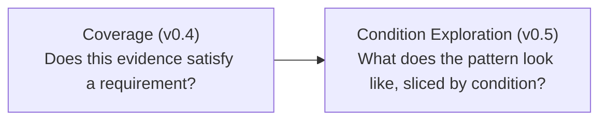

# Condition Explorer Contract (v0.5)

The authoritative reference for MultiSens's condition-exploration layer:
filtering, faceting, grouping/cross-tabulation, failure/N/A exploration,
and evidence traceability, all built on top of what
[coverage.md](coverage.md) already decided. See
[profiles.md](profiles.md) for the profile document this layer reads and
[coverage.md](coverage.md) for the `RequirementResult`/`GroupCoverage`
shapes it analyzes.

## What this layer answers

> Given a profile's already-computed PASS/FAIL/N/A results, which
> conditions explain the pattern - and which requirements/sessions does
> a specific condition combination actually touch?

A fundamentally different question from v0.4's:



**v0.5 never re-decides `PASS`/`FAIL`/`N/A`.** Every function in
[`app/domain/analysis.py`](../backend/app/domain/analysis.py) consumes
an already-computed `list[RequirementResult]` and only filters, groups,
tallies, or classifies what v0.4 already decided. If this layer and
`/coverage` ever disagree about a status, that's a bug in this layer,
never a second opinion.

## Filter model

`AnalysisFilter` (`conditions`, `group_id`, `task`, `status`) - every
field is an independent AND-ed predicate, deliberately flat and
structured, not a query language. No operator tree, no free-text query
string; the v0.5 architecture review explicitly rejected a generic query
DSL as unjustified complexity for this project's scale.

### Filtering is over `Requirement.conditions`, never `Session.metadata`

`filter_requirement_ids` matches a requirement's *own declared
conditions* against the filter - it never looks at evidence or
`Session.metadata` at all. The two coincide whenever evidence resolves
cleanly (a resolved session's metadata is always a superset of the
requirement's conditions - see [coverage.md](coverage.md#condition-matching)),
but facet discovery and filtering are cheap and available even before
any evidence has been evaluated, which is the whole point: an Explorer
tab should render its filter controls immediately, not wait for a
coverage computation to finish.

### Missing-key semantics: exclude, never wildcard

A requirement that doesn't declare a filtered condition key is
**excluded**, the same rule `conditions_are_subset` already enforces for
evidence matching (v0.4) and reused here directly, not reimplemented.
Filtering by a condition key *no* requirement in the profile declares
produces zero matches - a legitimate, common answer, not an error (see
[test_analysis_robustness.py](../backend/tests/test_analysis_robustness.py)).

### Type-sensitive matching

A condition value of the boolean `true` and the string `"true"` are
genuinely different values, never coerced into each other - Python's
`1 == True` is explicitly guarded against by the same
`conditions_are_subset` helper this layer shares with evidence
selection. `discover_facets` keeps them as two distinct facet values,
each with its own `requirement_count`.

## Facet discovery

`discover_facets(profile)` - one pass over
`profile.requirements[*].conditions`, no evidence or `RequirementResult`
needed at all, so it's always cheap and never depends on anything having
been evaluated yet. A `Facet` (`key`, `values: list[FacetValue]`) is
discovered fresh from whatever a given profile's requirements actually
declare - never a fixed enum of known condition names. A profile whose
requirements declare a condition key this module has never seen before
(the extended `cabin-safety-demo` profile's `eyewear` dimension, added
in Phase 50, is exactly this case) works with zero code changes.

## Aggregation

`AggregateCoverage` (`pass_count`, `fail_count`, `na_count`,
`requirement_coverage`, `evidence_completeness`) - the same two coverage
formulas [coverage.md](coverage.md#formulas) uses, computed via the
identical `status_counts`/`coverage_and_completeness` helpers (promoted
to public in Phase 44 specifically so this layer can never silently
disagree with v0.4's own arithmetic by reimplementing it a second way).
Both percentages always travel together here too - every
`AggregateResponse` on the wire carries both, never one alone.

### Grouping and cross-tabulation

- `group_by_condition(results, requirement_by_id, key)` - buckets by one
  condition dimension's observed value. A result whose requirement
  lacks `key` entirely is excluded from the breakdown, never lumped into
  an "unknown" bucket - that would misrepresent "this condition was
  never declared" as if it were an observed value in its own right.
- `cross_tabulate(results, requirement_by_id, row_key, col_key)` - the
  2D version; a result needs **both** condition keys present to land in
  any cell.
- The configuration×condition "heatmap" (Phase 47's frontend) is **not**
  a third grouping primitive - it's `group_by_condition` called once per
  configuration's own result set, reusing the 1D function rather than
  inventing a second axis type.

## Failure and N/A exploration

- `failure_breakdown(profile, results)` reuses coverage.md's own
  recursive group-tree walk (`aggregate_group_tree`, extracted in Phase
  44 without the "exactly one result per requirement" invariant
  `compute_configuration_coverage` enforces, since an arbitrary filtered
  subset doesn't have to satisfy it). Deliberately **not** pre-filtered
  to fail-only results - each group's pass/na counts stay visible
  alongside `fail_count`, since "8 failures" means little without
  knowing whether that's 8 of 10 or 8 of 400.
- `top_failing_groups(root)` flattens the tree and sorts by `fail_count`
  descending, for display.
- `classify_na_reason(reason)` pattern-matches the *exact* free-text
  reason strings `evidence.py`/`coverage.py` already produce - a
  deliberate coupling, stated explicitly rather than hidden. Guarded by
  a mandatory cross-layer test
  (`test_na_reason_classification_matches_real_ambiguous_source_scenario`
  and its siblings in `test_analysis.py`) that constructs every real
  N/A scenario through the actual `select_evidence`/`evaluate_requirement`
  functions, not hand-typed strings - this test caught a real gap while
  the classification table was first being written (the multi-
  prediction-source ambiguity message never actually contains the word
  "ambiguous," unlike the multi-session case).
- `na_breakdown(results)` groups by category. The frontend's Evidence
  tab (`components/NABreakdownPanel.tsx`) renders two groups, not a flat
  list: **"experiment never performed"** (`no_matching_evidence` - no
  session was ever collected under this condition combination) versus
  **"evaluation gap"** (`ambiguous_evidence`/`missing_metric`/`other` -
  the experiment ran, but the evaluation itself has a hole). Conflating
  the two would hide a real gap behind "we just haven't tested that
  yet."

### No derived evidence-quality badge

`RequirementResult.evidence` already carries `matched_samples`/
`sample_count`/`coverage` (v0.4). This layer's UI shows those numbers
directly, always, alongside any `PASS`/`FAIL` badge - the v0.5
architecture review explicitly rejected inventing a second, derived
"LIMITED EVIDENCE" badge or threshold. A `PASS` built on 3 samples stays
visibly a `PASS`; the raw denominator is right next to it, not hidden
behind a fabricated warning state.

## Reverse session lookup

`GET /api/sessions/{id}/profile-usage` - "which profile requirements
could this session serve as evidence for?" Defined as **candidacy**, not
resolution: it reuses `matches_conditions` (the same v0.4 evidence-
matching rule) directly, never v0.4's ambiguity/binding machinery. A
session that "lost" an ambiguity contest and isn't the currently-
resolved evidence for a requirement still shows up here - the audit
question ("could this session be evidence") is different from the
resolution question ("is this session the resolved evidence"), and
computing true resolution here would be both more expensive and the
wrong question for a dataset-auditing view. A simple reverse reference,
not a dependency-graph visualization - the master prompt explicitly
rejected building one.

## Non-causal language, everywhere

Every UI surface built in v0.5 - condition breakdown, cross-tabs,
failure exploration - describes **observed coverage under a condition
combination**, never impact, cause, or effect. Copy is explicit about
this ("observed coverage under each X value - not a causal claim") on
every section that could otherwise be misread as "X caused this
pass/fail outcome." This layer only slices and counts what v0.4 already
decided; it has no statistical or causal-inference machinery of any
kind, and none is implied anywhere in its output.

## API surface

```
GET  /api/profiles/{id}/facets
POST /api/profiles/{id}/analysis
GET  /api/sessions/{id}/profile-usage
```

One consolidated `/analysis` endpoint, not four separate routes
(`/facets`, `/explore`, `/breakdown`, `/crosstab`) - `group_by`'s length
selects the response shape:

```json
{
  "configuration_ids": null,
  "session_ids": null,
  "requirement_bindings": {},
  "filters": {"conditions": {"illumination": "night"}, "status": null},
  "group_by": ["occlusion"]
}
```

- `group_by: []` → filtered summary only.
- `group_by: ["x"]` → 1D breakdown (`groups[*].key` has length 1).
- `group_by: ["x", "y"]` → 2D cross-tab (`groups[*].key` has length 2).
  More than 2 dimensions is `422`.

Each `ConfigurationAnalysis` in the response carries `summary` (over the
filtered population, independent of `group_by`), `groups` (the
breakdown/cross-tab cells), `requirement_results` (the filtered results
themselves, so a failure/N/A list renders from this one response with no
second round trip), `failure_root`, and `na_breakdown` - always present,
computed against the same filtered population as everything else on the
response. `/analysis` reuses `/coverage`'s exact evidence-gathering
helpers (`_resolve_sessions`/`_resolve_configuration_ids`/
`_compute_requirement_results_by_configuration`, extracted in Phase 45
so neither route duplicates the other's logic) - the same "discovered
unless overridden" `configuration_ids`/`session_ids` convention, and the
same unfiltered-call caveat, apply here as in
[coverage.md](coverage.md#api-surface).

**Recompute, never persist** - same decision v0.4 made for
`RequirementResult`/`ConfigurationCoverage`. Every `/analysis` call
recomputes fresh from already-persisted evidence.

## Frontend

`ProfileDetail.tsx` gained four tabs (Coverage/Explorer/Failures/
Evidence) - no new top-level nav item, per the architecture review.
**Coverage's existing matrix logic moved under a tab unchanged**, live-
verified byte-identical to its pre-v0.5 behavior.

- **`components/ConditionFacetFilters.tsx`** - filter controls built
  dynamically from `GET .../facets`, no hardcoded condition names
  anywhere. Shared by the Explorer, Failures, and Evidence tabs, so
  "current filters" means the same URL-driven state everywhere.
- **Filter/tab state lives in `useSearchParams`**, URL-addressable
  (`?tab=explorer&illumination=night&status=fail`), the same pattern
  `Comparison.tsx` established in v0.3. A raw query-string value is
  resolved back to its originally-typed `ConditionValue` via the
  discovered facets before being sent to `/analysis` - never sent as a
  bare string.
- **`components/ExplorerPanel.tsx`** - the filtered configuration
  summary table, the condition breakdown section, and the 2D cross-tab
  section, each fetching independently via a shared `hooks/useAnalysis.ts`
  hook (one `/analysis` call per distinct filter/group_by combination,
  not per unrelated UI interaction - the architecture review's
  performance boundary).
- **`components/ConditionCrossTab.tsx`** - a generic row-dimension ×
  column-dimension grid, reused verbatim for both the single-
  configuration 2D cross-tab and the configuration×condition-value
  "heatmap." Every cell shows its requirement-count denominator (`n=X`)
  directly next to the coverage percentage, always visible, never
  hover-only - a 100% built from `n=1` reads differently from one built
  from `n=12`.
- **`components/CellDrillDown.tsx`** - clicking a cell with exactly one
  matching requirement reuses `RequirementDrillDown` directly; more than
  one gets a plain selectable list that opens the same
  `RequirementDrillDown` per pick, never a second bespoke detail view.
- **`components/FailuresPanel.tsx`** - total failure count under current
  filters, a top-failing-groups list (flattened/sorted client-side from
  `failure_root`, excluding the synthetic aggregation root), and a
  failing-requirements list.
- **`components/NABreakdownPanel.tsx`** - `na_breakdown` rendered as the
  two-category split described above, plus a matching N/A requirements
  list.
- **`components/RequirementDrillDown.tsx` enhanced (Phase 49)** - the
  full Profile → Group → Requirement → Conditions → Evidence → Session
  → Scenario → Configuration → Prediction source → Evaluation result →
  Sample counts → Acceptance criteria → Result chain, with real
  scenario/session *names* (resolved via `GET /api/scenarios` +
  `GET /api/sessions/{id}`, the same pattern `SessionDetail.tsx` already
  used) in place of raw ids, and a link to the session's own detail
  page. Zero new backend fields - every field was already on
  `RequirementResult`/`EvidenceReference`.
- **`SessionDetail.tsx`'s "Used by profiles" section** - calls
  `GET .../profile-usage` and lists each matching profile plus the
  specific requirement *names* (not just ids) that reference this
  session. A session matched by zero profiles renders a clean
  explanatory message, not an error.

## Synthetic reference profile

The standing "Generic Cabin Safety Demo" (see
[profiles.md](profiles.md#synthetic-reference-profile)) was extended in
place in Phase 50 with a third condition dimension (`eyewear`) precisely
so this layer has real, hand-verifiable multidimensional data to
exercise - the `illumination`×`eyewear` cross-tab for `cfg-thermal` is a
worked example of a condition dimension flipping a pass/fail outcome,
not just shifting a number. See
[examples/profiles/README.md](../examples/profiles/README.md).

## Known condition-explorer limitations

See [limitations.md](limitations.md) for the current authoritative
list; summarized here: `group_by` supports at most 2 dimensions
(a simultaneous 3+-dimension cross-tab doesn't exist), `classify_na_reason`
is coupled to `evidence.py`/`coverage.py`'s exact free-text reason
strings, filter/tab state lives only in the URL (no saved/named
presets), `/analysis` results are never persisted, and reverse session
lookup is candidacy, not a full dependency-graph visualization.
