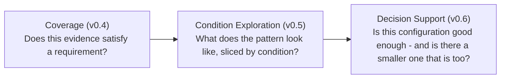

# Decision Support Contract (v0.6)

The authoritative reference for MultiSens's decision-support layer:
policy-based sufficiency, minimum sufficient sensor sets, Pareto/
dominance trade-off analysis, and requirement gap closure, all built on
top of what [coverage.md](coverage.md) and
[condition-explorer.md](condition-explorer.md) already decided. See
[profiles.md](profiles.md) for the profile document this layer reads and
[coverage.md](coverage.md) for the `RequirementResult`/`AggregateCoverage`
shapes it consumes. See
[deployment-tradeoffs.md](deployment-tradeoffs.md) for what v0.7 builds
*on top of* this layer's own `ConfigurationDecision`/`PolicyStatus`
output, joined with resource evidence ([resources.md](resources.md)) -
this document's own decision semantics are unchanged by v0.7 and reused
there verbatim, never re-decided.

## What this layer answers

> Given a profile's already-computed PASS/FAIL/N/A results across several
> sensor configurations, is any one of them "good enough" by an
> explicit, caller-supplied bar - and if several are, which is the
> smallest?

A fundamentally different question from v0.4's and v0.5's:



**v0.6 never re-decides `PASS`/`FAIL`/`N/A`.** Every function in
[`app/domain/decision.py`](../backend/app/domain/decision.py) consumes
already-computed `AggregateCoverage`/`RequirementResult` values - it
never re-implements v0.4's acceptance engine or v0.5's condition
grouping. A `DecisionPolicy` only says what counts as "good enough"; a
configuration's actual coverage numbers come from what v0.4/v0.5 already
computed.

## `DecisionPolicy` has no default, ever

```python
@dataclass
class DecisionPolicy:
    minimum_requirement_coverage: float
    minimum_evidence_completeness: float
    mandatory_requirements_must_pass: bool
    objective: DecisionObjective  # only 'minimize_sensor_count' in v0.6
```

Every field is required - there is deliberately no default anywhere on
this class (v0.6 architecture review, Q4/§29). A 100%-coverage/95%-
completeness/mandatory-pass bar is exactly the kind of arbitrary,
regulatory-looking default this project refuses to apply silently. The
frontend's Decision tab pre-fills one clearly-labeled example policy in
an editable form; the API itself never assumes one - an omitted `policy`
is always `422`, never a silent default (see
[test_decision_robustness.py](../backend/tests/test_decision_robustness.py)'s
legacy-profile test, which asserts this holds even for a profile with no
decision-specific concept anywhere in its own document).

`mandatory_requirements_must_pass` is a plain boolean meaning "every
requirement in the filtered population must be PASS (zero fail, zero
na)" - not a per-requirement scoped list. `Requirement` carries no
`mandatory` field (v0.4 never defined one - see
[limitations.md](limitations.md)), so a scoped "these specific
requirements are mandatory" policy would need a new field on
`Requirement` itself. That's a plausible future extension, not built
here because nothing in v0.6's own scope demonstrates the need for it.

`DecisionObjective` currently has exactly one value,
`minimize_sensor_count`. Cost/power/latency objectives are architected
for (an additive `Literal` extension) but deliberately not implemented
without real, semantically reliable hardware-characteristic data behind
them - v0.6 must not fabricate one.

## `PolicyStatus`: three values, never a binary good/bad

`sufficient` / `insufficient` / `undetermined` - `evaluate_policy`
(`AggregateCoverage`, `DecisionPolicy`) → `PolicyStatus` implements this
precisely:

- **Zero requirements in the filtered population** → `undetermined`
  ("no requirements to evaluate this policy against"), never a vacuous
  `sufficient`.
- **`minimum_evidence_completeness`** is checked against the population's
  **real, current** N/A count - never hypothetically resolved.
  Completeness (`decided / total`) can only ever *improve* as more N/A's
  resolve, reaching exactly `1.0` once everything is decided. A
  completeness shortfall is therefore always a "not enough evidence
  gathered yet" situation, in principle always fixable by more testing -
  never a permanent violation, so it can only ever produce
  `undetermined`, never `insufficient`.
- **`minimum_requirement_coverage` and `mandatory_requirements_must_pass`**
  DO depend on how any remaining N/A's eventually resolve, so they're
  bounded via best-case (every N/A → pass) and worst-case (every N/A →
  fail):
  - worst case still meets both → `sufficient` (true no matter how the
    N/A's resolve).
  - best case still fails either → `insufficient` (true no matter how
    they resolve).
  - otherwise (best case would pass, worst case would fail) →
    `undetermined` - the real answer depends on evidence that doesn't
    exist yet.
- Both checks must independently allow `sufficient`: completeness
  already met, **and** the worst-case coverage/mandatory bound met.

An earlier draft bounded completeness the same way as coverage above and
turned out to be dead code as a result - "every N/A resolved" always
means completeness = 1.0 in *both* the best- and worst-case
hypotheticals, so the threshold could never actually fire. Caught by a
failing test before it shipped; the fix (checking completeness against
the real N/A count directly, first) is what's implemented today and is
documented permanently as a code comment on `PolicyStatus` itself.

## Minimum sufficient sets: set-inclusion minimality, not sensor count

`find_minimal_sufficient_sets(sufficient)` - a sufficient configuration
`C` is minimal iff no other sufficient configuration's `sensor_ids` is a
**strict subset** of `C`'s (v0.6 architecture review, Q6/Q10) - stronger
and more useful than sorting by sensor count. Three configurations of
size 2 illustrate why: `{a, b}` is excluded once `{a}` alone is also
sufficient (a genuine, informative exclusion), while an unrelated `{c,
d}` survives alongside `{a}` even though neither is "smaller" than the
other by count - sensor-count-only sorting would either miss the `{a,
b}` exclusion entirely or wrongly try to rank `{a}` against `{c, d}`.

**May return several tied configurations - never arbitrarily narrowed to
one.** The v0.6 synthetic decision demo (see
[examples/profiles/README.md](../examples/profiles/README.md)) is
deliberately constructed to produce exactly one minimal set so its
numbers are trivially hand-verifiable, but `find_minimal_sufficient_sets`
itself has no such assumption baked in -
[test_decision.py](../backend/tests/test_decision.py) and
[test_decision_robustness.py](../backend/tests/test_decision_robustness.py)
both cover multi-way ties with genuinely disjoint sensor sets, sorted
deterministically by `configuration_id` for stable output.

## Pareto front and dominance: never a single "best" configuration

`A` dominates `B` iff `A` has same-or-fewer sensors, same-or-better
coverage, same-or-better completeness than `B`, **and** is strictly
better in at least one of those three dimensions. A `None` coverage/
completeness (zero decided requirements) is treated as strictly worse
than any real value on that dimension; two `None`s tie - an honest way
to compare a completely-undecided configuration without crashing.
`find_pareto_front` returns every non-dominated configuration - the
trade-off curve itself, not one arbitrarily "best" point on it. Even a
configuration with `insufficient`/`undetermined` policy status can
appear on the Pareto front: dominance is a pure sensor-count/coverage/
completeness comparison, independent of whether any configuration
actually clears the policy bar (see
[test_decision_robustness.py](../backend/tests/test_decision_robustness.py)'s
no-sufficient-configuration case).

No optimization library - O(n²) pairwise comparison, which is fine at
the realistic scale here: configuration count is bounded by *evaluated
evidence*, never a generated power set (master prompt §23) - realistically
dozens, not thousands.

Dominated configurations are never hidden - the Decision tab shows the
Pareto front prominently and lists dominated configurations underneath,
collapsed but visibly labeled `Dominated`, never described as "bad."

## Requirement gap closure: four transitions, never one delta

`compute_requirement_transitions(baseline_results, candidate_results)`
compares two already-evaluated configurations' `RequirementResult`s and
returns four separately-exposed categories, never collapsed into a
single count (master prompt §13: "do not reduce all of this to a single
delta"):

- `fail_to_pass` - a real improvement.
- `na_to_pass` - new evidence resolved a previously-unanswerable
  requirement, and it turned out to pass.
- `pass_to_fail` - a real regression.
- `pass_to_na` - a previously-decided requirement lost its evidence
  under the candidate configuration (e.g. a filter/binding change, not
  typically the sensor swap itself).

Both sides must cover the **exact same requirement population** (same
profile, same filter) - a precondition, not silently reconciled;
`compute_requirement_transitions` raises `ValueError` rather than diff a
meaningless mismatch.

`compute_condition_gap_summary` breaks the coverage delta down by one
condition dimension at a time, reusing v0.5's `group_by_condition`
directly for each side and subtracting bucket-by-bucket - no grouping
logic duplicated (master prompt §40/§15). A condition value present on
only one side gets an empty aggregate on the other, never silently
dropped from the summary. Every rendering of this data is explicitly
labeled **"observed coverage difference under condition - not a causal
claim"** - same non-causal discipline v0.5 established for its own
condition breakdowns, extended here.

## Redundancy and policy-critical: scoped wording only

`find_direct_removals` reports, for each sensor in a configuration,
whether the actual sensor-removed configuration was ever evaluated. The
wording is deliberately scoped to *this configuration, under the current
policy* - never "redundant sensor" or "necessary sensor" as an intrinsic
property of the sensor itself (master prompt §11/§12, v0.6 architecture
review Q10):

- **"Removable without violating the current policy"** - the direct
  removal was evaluated and is itself `sufficient`.
- **"Policy-critical within this configuration"** - the direct removal
  was evaluated and is `insufficient` or `undetermined`.
- **"No evaluated configuration exists for this removal"** - `NO
  EVIDENCE` (see below), reported explicitly, never estimated.

`configuration_id`/`policy_status` are both `None` together whenever an
exact configuration was never evaluated - true for a direct-removal
sweep entry, an explicitly-requested `configuration_ids` entry, or a
`gap_analysis` candidate that was never run. **Never estimated or
interpolated** (master prompt §24) - `find_direct_removals` looks the
removal's exact sensor set up in a dict keyed by every discovered
configuration's own `sensor_ids`; if it isn't there, it isn't there.

## Sensor-instance identity, not modality

`front_rgb` and `rear_rgb` are two separate physical camera positions,
tracked as distinct configuration members throughout this entire layer,
never merged just because they share modality `rgb`. `Prediction.sensor_ids`
(`backend/app/domain/models.py`) was already a fully free-form
`list[str]` with zero coupling to ROS topics or modality before v0.6 -
`derive_configuration_id` already treated `front_rgb`/`rear_rgb` as
distinct, valid configuration members with zero code changes required.
This is why **Phase 57 (sensor-identity/ROS migration) was reviewed and
explicitly deferred** (issue #58, closed): the one-sensor-per-modality
restriction lives entirely in `sensor_config.py`'s live-ingestion
launch-time validation, a v0.1 **live-ingestion/dashboard-viewing**
concern this decision-support feature never touches, since it reasons
entirely over already-ingested evaluation data via the same REST
batch-ingestion path every synthetic demo has used since v0.2. What
remains genuinely blocked, unchanged, and honestly documented in
[limitations.md](limitations.md): live, simultaneous dashboard viewing of
two physical cameras sharing a modality.

## No causal language, no universal importance score, ever

Every UI surface built in v0.6 - policy status, minimum sufficient sets,
Pareto front, gap/redundancy analysis - describes what an explicit
policy applied to already-observed evidence concludes, never a cause,
effect, or intrinsic sensor property. There is no `importance_score`
field anywhere in this layer's domain model (master prompt §16) -
`SensorAdditionAnalysis` deliberately exposes many small, structured
fields (added/removed sensor ids, coverage/completeness deltas, the four
transition lists, both configurations' policy status) rather than
collapsing them into one magic number. Grep-verified after every phase:
the only causal/importance-adjacent matches anywhere in `backend/app`
and `frontend/src` are the explicit disclaimers themselves ("not a
causal claim," the scoped removability/criticality wording above).

## API surface

```
POST /api/profiles/{id}/decision-analysis
```

One consolidated endpoint, not a second `/gap-analysis` route -
`gap_analysis` is an optional nested request/response section on the
same call, since it always needs the same evidence
(`configuration_ids`/`session_ids`/`filters`/`requirement_bindings`) the
main call already gathered. Reuses `/coverage`/`/analysis`'s exact
evidence-gathering helpers
(`_resolve_sessions`/`_resolve_configuration_ids`/
`_compute_requirement_results_by_configuration`) - the same
"discovered unless overridden" convention applies here as in
[coverage.md](coverage.md#api-surface).

```json
{
  "policy": {
    "minimum_requirement_coverage": 1.0,
    "minimum_evidence_completeness": 0.95,
    "mandatory_requirements_must_pass": false,
    "objective": "minimize_sensor_count"
  },
  "filters": {"conditions": {}},
  "configuration_ids": null,
  "session_ids": null,
  "gap_analysis": {
    "baseline_configuration_id": "cfg-front_rgb",
    "candidate_configuration_id": "cfg-front_rgb-rear_rgb-sim_thermal",
    "include_removal_sweep": true,
    "group_by": []
  }
}
```

`policy` is the only required field - everything else defaults the same
way `/coverage`/`/analysis` already do. The response's `configurations`
list carries one entry per discovered configuration, `policy_status:
null` (with empty `sensor_ids`/zero `sensor_count`) for any
`configuration_ids` entry that was never actually evaluated - `NO
EVIDENCE`, reported directly, never silently dropped.
`sufficient_configuration_ids`, `minimal_sufficient_configuration_ids`,
and `pareto_front_configuration_ids` are flat lists of configuration
ids, each naming an entry already present in `configurations` - not a
second, separate representation of sensor sets.

`gap_analysis.baseline_configuration_id`/`candidate_configuration_id`
must each name a configuration that has evidence in this analysis (in
`configurations`, not `NO EVIDENCE`) - otherwise `422`, since a gap
analysis against a configuration that was never evaluated has nothing
real to compare. The removal sweep is different: each removed-sensor
entry is reported, `NO EVIDENCE` and all, never rejected.

**Recompute, never persist** - same decision v0.4/v0.5 made for
`RequirementResult`/`AnalysisResponse`. Every `/decision-analysis` call
recomputes fresh from already-persisted evidence.

## Frontend

`ProfileDetail.tsx` gained a fifth tab, **Decision** - no new top-level
nav item, matching v0.5's own pattern of adding tabs rather than pages.

- **`components/DecisionPanel.tsx`** - the policy form (editable
  coverage/completeness/mandatory-pass, objective shown but not
  editable since only one exists), the condition facet filters (reused
  from [condition-explorer.md](condition-explorer.md)), the per-
  configuration summary table, minimum sufficient sets (one card per
  tied minimal configuration, never narrowed to one), the Pareto front
  (non-dominated table prominent, dominated configurations collapsed
  underneath), and the gap/redundancy section.
- **`components/PolicyStatusBadge.tsx`** - a four-state badge:
  `sufficient` (emerald) / `insufficient` (red) / `undetermined` (amber)
  / `null` → "No evidence" (slate), always distinguishing "policy not
  met" from "never evaluated."
- **Gap/redundancy section** - baseline/candidate configuration pickers
  (populated only from already-evaluated configurations, never a
  `NO EVIDENCE` entry), a sensor-removal-sweep checkbox, the four
  transition counts as clickable buttons that open a drill-down built
  from the candidate configuration's own `requirement_results` -
  reusing `CellDrillDown`/`RequirementDrillDown` verbatim, never a new
  requirement detail renderer.
- **`SensorChips`** - renders each sensor id plus a `SourceTypeBadge`
  only when that id has a matching `config/sensors.yaml` entry;
  otherwise renders the id alone with no badge - graceful degradation,
  never an error or a fabricated source type. Load-bearing for the
  synthetic decision demo (below), whose reference sensor ids are
  deliberately evaluation-only.

## Synthetic decision demo

The "Generic Exterior Sensing Decision Demo" (see
[examples/profiles/README.md](../examples/profiles/README.md)) is a
second, genuinely different synthetic profile/dataset from the sensor-lab
demo - not a variant squeezed into it (v0.6 architecture review,
Q23). Its reference sensor ids (`front_rgb`, `rear_rgb`, `sim_thermal`,
`sim_depth`) were deliberately **not** added to `config/sensors.yaml`:
doing so would violate the one-sensor-per-modality launch-time guard
(`front_rgb`/`rear_rgb` are both modality `rgb`; `sim_thermal`/
`sim_depth` would collide with the already-configured live `thermal`/
`depth` entries powering the sensor-lab-demo dashboard). These four ids are
evaluation-only, with `SensorChips`' graceful no-badge fallback covering
display. The Decision tab shows a standing **"SYNTHETIC DECISION DEMO"**
banner (driven by the profile's own `metadata.synthetic: true`) making
explicit that its requirement outcomes demonstrate functionality only
and are not a claim about real or simulated sensor performance -
physical input source and synthetic evaluation evidence are visually and
textually distinguished everywhere this demo appears.

## Known decision-support limitations

See [limitations.md](limitations.md) for the current authoritative list;
summarized here: `objective` supports only `minimize_sensor_count` (no
cost/power/latency objective exists yet); `mandatory_requirements_must_pass`
is an all-or-nothing population flag, not a per-requirement scoped list
(`Requirement` has no `mandatory` field); dominance/Pareto computation is
O(n²), bounded by evaluated-configuration count, not a generated power
set; `DecisionAnalysisResponse` is never persisted (recomputed fresh
every call); and sensor-identity/ROS migration (simultaneous live
dashboard viewing of two same-modality physical sensors) remains
deferred, unchanged from before v0.6. v0.7's generalized Pareto front
(`deployment-tradeoffs.md`) reuses this exact O(n²) bound, extended to
arbitrary caller-chosen dimensions.
