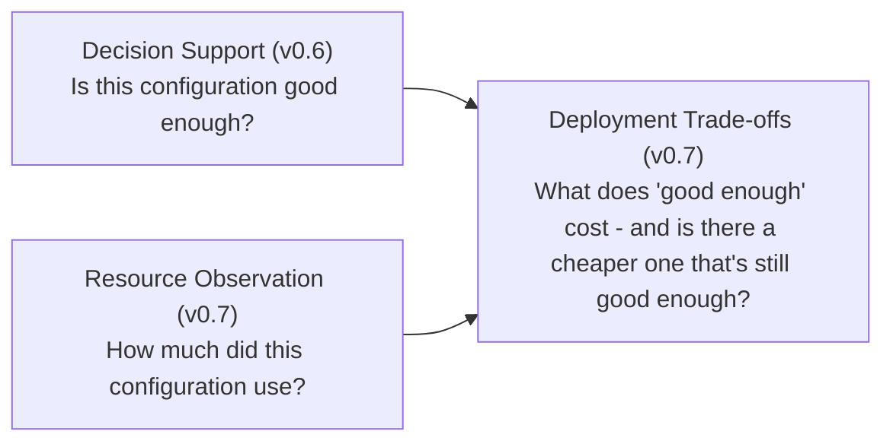

# Deployment & Resource Trade-off Contract (v0.7)

The authoritative reference for MultiSens's trade-off layer: joining
v0.6's decision evidence with v0.7's resource evidence
([resources.md](resources.md)) without merging their semantics -
comparability rules, resource constraints, a generalized Pareto front,
and the `/tradeoffs` API. See [decision-support.md](decision-support.md)
for the `ConfigurationDecision`/`PolicyStatus` this layer reuses
unchanged, and [resources.md](resources.md) for the
`ConfigurationResourceProfile` it joins in.

## What this layer answers

> Given a configuration's already-computed decision evidence (v0.6) and
> its already-computed resource evidence (v0.7), what's the trade-off -
> and is a smaller/cheaper configuration available without losing
> requirement coverage?



**This layer never re-decides `policy_status`/`requirement_coverage`/
`evidence_completeness`, and it never re-measures a resource value.**
`build_configuration_tradeoff` is a pure composition - if this layer and
`evaluate_configurations`/`compute_configuration_resource_profile` ever
disagree about a value, that's a bug in this layer, never a second
opinion (the same posture v0.5's own module docstring already states for
its relationship to v0.4).

## `ConfigurationTradeoff`: decision and resource evidence, side by side

```python
@dataclass
class ConfigurationTradeoff:
    configuration_id: str
    sensor_count: int
    requirement_coverage: float | None
    evidence_completeness: float | None
    policy_status: PolicyStatus
    resource_profile: ConfigurationResourceProfile | None
    resource_validity: Literal['complete', 'partial', 'unavailable']
```

`resource_profile` is `None` whenever no resource evidence was ever
requested/gathered for this configuration - distinct from a profile that
was requested and exists with `validity='unavailable'` (evidence was
sought but none found). `resource_validity` normalizes both cases to one
honest status without losing the underlying distinction, which stays
visible via `resource_profile` itself.

Decision evidence and resource evidence are genuinely independent axes:
a configuration can be policy-`sufficient` with zero resource evidence,
or carry real resource evidence while having no decision evidence at all
(named but never evaluated against this profile's requirements). Neither
condition hides the other - confirmed directly by the v0.7 robustness
review, which caught and fixed a real regression where the second case
was silently dropping resource evidence (see
[CHANGELOG.md](../CHANGELOG.md)'s v0.7 entry).

## Comparability: four independent rules

Two resource profiles are comparable only if every rule below holds -
`comparable` and `warnings` always travel together; `comparable=False`
never silently hides the numbers, and a non-empty `warnings` list never
silently normalizes the difference away:

1. **Execution platform must match.** An unresolved/unknown platform
   (`UNKNOWN_PLATFORM_ID`, see [resources.md](resources.md#executionplatform-and-unknown_platform_id))
   is never comparable, even to itself - two "unknown" platforms are not
   assumed to be the same machine. A real, differing `platform_id` on
   each side produces an explicit "different execution platforms"
   warning. This is the whole of what v0.7 has to say about
   cross-platform validation today: `check_comparability` was built to
   support it, but no second real platform's data has been captured to
   exercise the "two known, matching platforms" success path beyond a
   single machine - the Jetson/cross-platform validation phase found
   none reachable in this release's environment and closed explicitly
   deferred (issue #76, see [limitations.md](limitations.md)).
2. **Resolution must match**, read from the caller-supplied observation
   metadata (`resolution` key) - `ConfigurationResourceProfile` itself
   deliberately doesn't carry this field (see below).
3. **Requested FPS must match**, same metadata-sourced comparison
   (`target_fps` key).
4. **Measurement duration must be the same order of magnitude** - a
   generous, explicitly-heuristic 10x bound (same "documented heuristic,
   not evidence-based" honesty treatment as `min_common_sample_count`/
   `coverage_warning_threshold_pp`, see [limitations.md](limitations.md)),
   not a precisely justified statistical threshold.

`resolution`/`target_fps` live on `ResourceObservation.metadata`, not on
`ConfigurationResourceProfile` - comparability is the first layer that
needs them, so `check_comparability` takes each side's representative
metadata as a caller-supplied parameter rather than growing v0.7's
summary shape after the fact.

## Resource deltas: observed, never causal

`compute_resource_delta` uses each side's per-metric **mean** as the
representative value - the same statistic a headline comparison table
would show first; median/p95/min/max stay available on each side's own
`ConfigurationResourceProfile` for anyone who needs the fuller picture,
never discarded. Wording is strictly observed-delta ("candidate used
+5.1 Mbps more than baseline"), **never** causal ("the added sensor cost
5.1 Mbps") - the same non-causal discipline every prior release's
comparison/gap-analysis language already follows, grep-verified by a
dedicated test that scans this module's own source for causal/
importance-score language.

## Resource constraints: reusing `AcceptanceCriterion`, not a new grammar

A resource constraint is exactly an `AcceptanceCriterion`
(`metric`/`operator`/`value`) evaluated via `ACCEPTANCE_OPERATORS`
(promoted from coverage.py's private `_OPERATORS` in this release, zero
behavior change) - so a resource constraint can never silently disagree
with how v0.4 already applies `>=`/`<=`/`>`/`<`/`==`.

```python
ResourceConstraintStatus = Literal['pass', 'fail', 'na']
```

`evaluate_resource_constraint` uses the profile's **mean** for the
target metric (same representative statistic `compute_resource_delta`
uses). A metric absent from the profile - never measured, or measured
but entirely `unavailable` - is always `'na'`, never `'fail'`: an
unmeasured constraint is not the same claim as a measured-and-failing
one, the same posture `evaluate_criterion` already takes for coverage
requirements.

## Qualification: a direct 3-state map, deliberately not `evaluate_policy`'s bounding

```python
QualificationStatus = Literal['qualifies', 'does_not_qualify', 'undetermined']
```

- Any `fail` dominates → `does_not_qualify`, regardless of how many other
  constraints pass.
- Any `na` with everything else passing → `undetermined` - never treated
  as qualifying, since an unmeasured constraint is not evidence it would
  have passed.
- Zero constraints → `undetermined`, never a vacuous `qualifies` (same
  "empty population is never silently a real answer" discipline used
  throughout this project).
- Only when every constraint is a real `pass` → `qualifies`.

**This is deliberately not the same best-case/worst-case N/A-resolution
bounding `evaluate_policy` (v0.6) uses for unresolved evaluation
evidence.** That bounding exists because an evaluation N/A can only ever
resolve to pass or fail *later*, as more testing happens. A missing
resource measurement has no equivalent "will resolve later" property -
it is just missing, now, for this exact measurement window. Applying
`evaluate_policy`'s hypothetical-bounding math here would be a category
error, not a consistency win - documented directly in
`app/domain/resources.py`'s own code so this distinction survives future
edits.

## Generalized Pareto: the same algorithm, arbitrary dimensions

`find_pareto_front_general`/`dominates_general` are a **mechanical
generalization** of [decision-support.md](decision-support.md#pareto-front-and-dominance-never-a-single-best-configuration)'s
fixed 3-dimension version - not a second algorithm. Where v0.6's version
is fixed to `sensor_count`/`requirement_coverage`/`evidence_completeness`,
this version takes an arbitrary caller-chosen `dict[str, 'minimize' |
'maximize']`, so v0.7 can add resource metrics (CPU, network, latency,
...) to the same trade-off analysis without reimplementing dominance.
Proven equivalent by a parametrized regression test: called with exactly
decision.py's three fixed dimensions, it produces identical results to
`find_pareto_front`/`find_dominated_configurations` on every scenario
that module's own test suite covers - plus a beyond-3-dimensions case a
fixed version could never express. Same `None`-is-always-worst rule,
independent of direction; O(n²) pairwise, same justification as v0.6's
version (configuration count is bounded by evaluated evidence, never a
generated power set).

## No combined score, anywhere, ever

There is no `overall_efficiency_score`/`deployment_score`/any single
number blending decision and resource evidence anywhere in this layer's
domain model - `ConfigurationTradeoff` deliberately exposes many small,
structured fields (decision summary, resource profile, constraint
results, qualification) rather than collapsing them into one magic
number, the same discipline `SensorAdditionAnalysis` (v0.6) already
established. Grep-verified after every phase that touched this module:
the only matches for score/importance-adjacent language anywhere in
`backend/app` and `frontend/src` are this exact rejection statement
itself.

## A mismatched unit is caught at read-time, not ingestion

`unit` is a fully open string at ingestion (see
[resources.md](resources.md#supported_resource_metrics-the-reviewed-six)) -
nothing stops two rows for the same metric/configuration from carrying
different units. `compute_resource_metric_summary` raises when it
actually tries to average them (v0.7 robustness review, issue #77):
the `/tradeoffs` endpoint catches this and returns a clean `422` naming
the offending configuration, rather than an unhandled `500` - fixed
directly by this review before release, see
[CHANGELOG.md](../CHANGELOG.md)'s v0.7 entry.

## API surface

```
POST /api/profiles/{id}/tradeoffs
```

Reuses `_resolve_configuration_ids`/`_compute_requirement_results_by_configuration`
exactly like `/coverage`/`/analysis`/`/decision-analysis` - no new
discovery logic, and this layer never re-implements
`build_configuration_tradeoff`/`evaluate_resource_constraint`/
`find_pareto_front_general` at the API layer. Resource evidence is
inherently single-session-scoped (see
[resources.md](resources.md#session-not-a-new-resourcemeasurementrun-entity)),
so - unlike `/decision-analysis` - this route takes one **required**
`session_id`, not an optional `session_ids` list.

```json
{
  "policy": {
    "minimum_requirement_coverage": 1.0,
    "minimum_evidence_completeness": 0.95,
    "mandatory_requirements_must_pass": false,
    "objective": "minimize_sensor_count"
  },
  "session_id": "ridesafe-demo-day-session",
  "resource_metrics": ["cpu_percent", "memory_mb"],
  "resource_constraints": [
    {"metric": "cpu_percent", "operator": "<=", "value": 50.0}
  ],
  "pareto_dimensions": {
    "requirement_coverage": "maximize",
    "cpu_percent": "minimize"
  },
  "resource_comparison": {
    "baseline_configuration_id": "cfg-ridesafe_front_rgb",
    "candidate_configuration_id": "cfg-ridesafe_front_rgb-ridesafe_rear_rgb"
  }
}
```

`policy` and `session_id` are the only required fields. `resource_metrics`
defaults to empty - "no resource evidence requested," every
configuration's `resource_profile` stays `None`. Each `resource_metrics`/
`resource_constraints` metric must be in `SUPPORTED_RESOURCE_METRICS`
(`422` otherwise); `pareto_dimensions` keys must each be one of the three
decision-side fields or an already-requested resource metric - never an
unrequested metric, which would be silently all-`None` for every
configuration.

`resource_comparison` is an optional nested request/response section,
not a separate route - the same "`gap_analysis` on `/decision-analysis`"
pattern v0.6 established, since a resource comparison always needs the
same evidence this call already gathered for its baseline/candidate
configuration ids. Either id naming a configuration with no evidence in
this analysis is `422` - nothing real to compare.

A `configuration_id` explicitly named but never evaluated (no decision
evidence) is reported with `policy_status: null`, `sensor_count: 0` -
`NO EVIDENCE`, the same convention `/decision-analysis` already
established - **and its resource evidence, if any exists, is still
attached and reported**, per the independent-axes fix above.

**Recompute, never persist** - `TradeoffResponse` is never persisted,
same decision every prior analysis layer made for its own response
shape. Every `/tradeoffs` call recomputes fresh from already-persisted
evidence.

## Frontend

`ResourcesPanel.tsx` (see [resources.md](resources.md#frontend) for the
base resource table/drill-down) gained this layer's own sections in this
release:

- **`components/QualificationBadge.tsx`** - `QUALIFIES`/
  `DOES_NOT_QUALIFY`/`UNDETERMINED`, the v0.7 counterpart to
  `PolicyStatusBadge` - a genuinely different question (resource-
  constraint verdict) never conflated with `policy_status`.
- **`ResourceConstraintForm`** - reuses the exact acceptance-criterion
  editing shape (metric/operator/value) the Decision tab's policy form
  already established, not a new grammar.
- **`QualificationTable`** - renders the backend's own
  `evaluate_resource_qualification` output directly, never recomputed
  client-side; N/A constraints render distinctly from pass/fail, never
  as qualifying.
- **`ResourceComparisonSection`** - baseline/candidate pickers folded
  into the same `/tradeoffs` call (one consolidated request, not a
  second endpoint), an explicit "Observed delta" table, comparability
  warnings always shown alongside the numbers, never hidden and never
  silently suppressing them.
- **`ResourceParetoSection`** - user-selectable x/y dimensions (fixed,
  non-editable minimize/maximize directions per dimension - never an
  arbitrary weighted composite), offering only dimensions with real
  evidence somewhere in the session.

## RideSafe and PropertyWatch: two worked examples

Two independent reference demos exercise this whole layer end to end -
full derivation, exact numbers, and loading instructions in
[examples/profiles/README.md](../examples/profiles/README.md):

- **RideSafe** - 70mai front/rear dashcams, framed strictly as *ride
  monitoring and incident evidence*, never safety-certification/driver-
  monitoring/occupant-monitoring. One shared task, a day/night condition
  split across two sessions, and a "two cameras share some overhead"
  resource story. Its day-only Resources-tab view is a real, honest
  demonstration of single-session-scoped resource evidence's limits: it
  genuinely cannot see the two night-conditioned requirements, so every
  configuration's `policy_status` there reads `undetermined` even though
  the underlying coverage percentages still differ - not a bug.
- **PropertyWatch** - a generic multi-camera property monitoring setup
  (home, garage, workshop, storage space, or small warehouse - never one
  hardcoded building type), no surveillance-identification or
  face-recognition features. Three nested configurations, one task per
  camera position (so a camera-less area is genuinely N/A, never a
  fabricated fail), and a "roughly linear per added camera" resource
  story - the flagship "is the third camera worth its resource load"
  worked example, producing a genuine 3-point Pareto staircase.

Both demos' synthetic accuracy **and** resource numbers are
independently re-derived (nearest-timestamp matching, plain Python, zero
domain-code imports) and cross-checked against the real running API -
see `test_ridesafe_demo.py`/`test_propertywatch_demo.py`.

## Known deployment-trade-off limitations

See [limitations.md](limitations.md) for the current authoritative list;
summarized here: cross-platform comparability has only been exercised
against one real platform (Jetson validation explicitly deferred);
generalized Pareto is O(n²), same bound as v0.6's fixed version;
`TradeoffResponse` is never persisted; and resource evidence being
single-session-scoped means a partial-condition session can genuinely
produce `undetermined` policy status even when its underlying coverage
numbers differ - demonstrated live by the RideSafe demo above, not a
defect.
