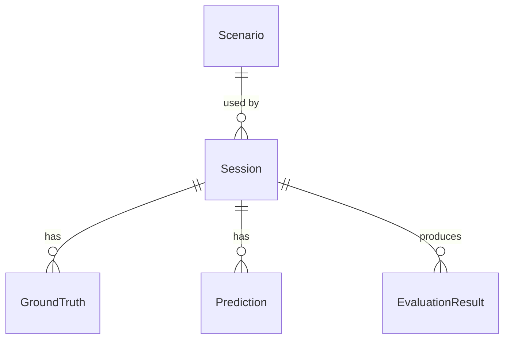

# Evaluation Contract (v0.2)

The authoritative reference for MultiSens's evaluation layer: the domain
model, the timestamp-matching algorithm, classification metric semantics,
the API surface, persistence, and the import format. See
[architecture.md](architecture.md) for where this layer sits relative to
v0.1's ingestion/sync/diagnostics stack, [comparison.md](comparison.md)
for the configuration-comparison layer (v0.3),
[profiles.md](profiles.md)/[coverage.md](coverage.md) for the
requirement-profile layer (v0.4), and
[condition-explorer.md](condition-explorer.md) for the v0.5 condition-
exploration layer, all built directly or indirectly on top of this
one's `EvaluationResult`s, and [limitations.md](limitations.md) for what
this layer deliberately doesn't do yet.

## What this layer answers

> For a configured scenario and a set of predictions, how does each
> sensor configuration perform against ground truth?

MultiSens never runs inference itself. A prediction may come from ROS, a
REST call, an imported file, another computer, a Python script, or
proprietary software - MultiSens evaluates it, and doesn't need to know
how it was produced. See [connector-api.md](connector-api.md) for the
analogous sensor-onboarding philosophy this mirrors.

## Domain model



Defined in [`backend/app/domain/models.py`](../backend/app/domain/models.py)
as plain Pydantic models - zero `fastapi`, `sqlite3`, or `rclpy` imports
anywhere in that file, verified by the fact that every one of Phases
10-18 kept it that way.

- **Scenario** - `id`, `name`, `description`, `tags`, `metadata`. A label
  sessions point at; no lifecycle beyond create/list.
- **Session** - `id`, `name`, `scenario_id`, `started_at`, `ended_at`,
  `status` (`created`/`running`/`completed`/`failed`), `metadata`.
- **GroundTruth** - `id`, `session_id`, `timestamp_ms`, `task`, `value`
  (opaque dict - see [Task values](#task-values-generic-by-design)),
  `metadata`.
- **Prediction** - `id`, `session_id`, `timestamp_ms`, `source_id` (who
  produced it), `sensor_ids` (what input it saw - **never** the same
  field as `source_id`, see below), `configuration_id` (derived, not
  chosen), `task`, `value`, `confidence`, `latency_ms`, `metadata`.
- **EvaluationResult** - `id`, `session_id`, `configuration_id`, `task`,
  `format_version`, `tolerance_ms`, `sample_count`, `matched_samples`,
  `unmatched_predictions`, `unmatched_ground_truth`, `metrics` (dict of
  `str -> float | None`), `confusion_matrix`, `computed_at`.

### `source_id` vs. `sensor_ids` - the distinction that must never collapse

A `Prediction` names **who produced it** (`source_id`, e.g.
`"rgb_classifier"`) separately from **what input it saw**
(`sensor_ids`, e.g. `["rgb"]`, or `["depth", "rgb"]` for a fusion
prediction). Conflating these would make ablation-by-configuration
(comparing `cfg-rgb` against `cfg-depth-rgb`) meaningless. Enforced by
construction, not convention - there is no code path where one can stand
in for the other.

### `configuration_id` is derived, never chosen

```python
def derive_configuration_id(sensor_ids: list[str]) -> str:
    return 'cfg-' + '-'.join(sorted(sensor_ids))
```

Same `sensor_ids` in any order always produce the same id
(`["depth", "rgb"]` and `["rgb", "depth"]` both become `cfg-depth-rgb`).
A `Prediction` may omit `configuration_id` (it gets derived); if
supplied, it must match the derived value or the prediction is rejected
- there is no way for a caller to set an inconsistent configuration
label, which is what keeps `configuration_id` trustworthy as a grouping
key throughout the rest of this document.

### Task values: generic by design

`GroundTruth.value` and `Prediction.value` are opaque dicts, not a
classification-specific `label: str` field. A `presence` classification
event today (`{"label": "present"}`) and a hypothetical future detection
event (`{"bbox": [...], "class": "person"}`) fit through the exact same
field - proven by a dedicated test
(`test_prediction_value_shape_is_generic_not_classification_specific`),
not just asserted. **v0.2's metric engine only implements classification**
(see below) - a detection/regression evaluator would be new code beside
`evaluate_classification`, not a schema change.

## Timestamp matching

[`backend/app/domain/matching.py`](../backend/app/domain/matching.py)
(`match_by_timestamp`) - pure function, no persistence/transport import.

**Algorithm**: greedy one-to-one nearest-neighbor. Ground truth is
processed in increasing timestamp order; each point is matched to the
closest not-yet-consumed prediction within `tolerance_ms`. Every
prediction is consumed by at most one ground-truth point. Ties break to
the **earlier-timestamp** candidate. Unmatched items on either side are
returned in full (not just counted) as `unmatched_ground_truth` /
`unmatched_predictions`.

**Complexity**: both inputs are sorted once, then a pointer over
predictions only ever advances - O(g + p) when tolerance is smaller than
the typical sample spacing (the expected case). A pathological
huge-tolerance/dense-prediction input degrades toward O(g · w); still
trivial at this project's target scale (a few thousand events).

**`tolerance_ms` has no measured default**, unlike the ROS/DDS sync
tolerance in [architecture.md](architecture.md#synchronization-measured-not-guessed).
Ground truth and predictions can originate from entirely different
systems with no shared clock reference, so there is no analogous "real
skew" to measure. The API default (`100.0`) is a starting point to tune
per scenario, not evidence-based.

**Timestamp units**: plain milliseconds (`float`), caller-defined origin
(epoch, session-relative, whatever the ingestion path already uses) -
MultiSens does not interpret them beyond arithmetic difference.

## Classification metrics

[`backend/app/domain/metrics.py`](../backend/app/domain/metrics.py)
(`evaluate_classification`) - the only evaluator that exists in v0.2.

- **Accuracy** = correct / `matched_samples`. Computed over matched
  samples only - an unmatched item is a coverage problem, not a
  wrong-answer problem, and folding it in would understate correctness
  for a reason that isn't the model's fault.
- **Label set** = the union of actual/predicted labels seen in the
  *matched* set, sorted - never the full label universe either input
  file happens to define, and never hardcoded to binary. This is what
  makes the confusion matrix dimensions dynamic.
- **Macro** precision/recall/F1 = unweighted mean over per-class values,
  **excluding classes where the value is undefined** (zero denominator -
  e.g. a class the model never predicted has undefined precision).
  Undefined values are never counted as zero; doing so would silently
  drag the average down for a reason distinct from the model being
  wrong.
- **Micro** precision/recall/F1 = aggregate TP/FP/FN across all classes
  first, then compute. For this task shape (single-label multi-class),
  micro precision = micro recall = micro F1 = accuracy - included
  because the spec calls for it and it's cheap given the confusion
  matrix is already built, not because it adds new information here.
- **`None` means N/A, never `0.0`.** The rule most likely to get silently
  violated during implementation, so it has dedicated tests at every
  layer: the metric engine itself
  (`test_precision_undefined_for_never_predicted_class`), the API
  (`test_evaluate_with_no_predictions_returns_na_not_zero`), and the
  frontend (`formatMetric`/`formatCoverage` in `frontend/src/format.ts`,
  with the same "null renders as N/A, a real zero renders as 0" test
  pattern used for the v0.1 `formatMs` regression).

## API surface

All evaluation routes nest under `/api/sessions/{id}/...` - ground truth,
predictions, and results are meaningless without a session, so there is
no top-level `/api/predictions`.

```
POST   /api/scenarios
GET    /api/scenarios

POST   /api/sessions
GET    /api/sessions
GET    /api/sessions/{id}
POST   /api/sessions/{id}/start
POST   /api/sessions/{id}/complete

POST   /api/sessions/{id}/ground-truth/batch
POST   /api/sessions/{id}/predictions/batch
GET    /api/sessions/{id}/ground-truth
GET    /api/sessions/{id}/predictions

POST   /api/sessions/{id}/evaluate      # body: {task, configuration_ids?, tolerance_ms?}
GET    /api/sessions/{id}/evaluation    # every persisted result for this session
GET    /api/sessions/{id}/timeline      # ?task=&configuration_id=&tolerance_ms= - see below
```

### Batch ingestion and partial failure

Batch items are accepted as loose dicts, not a typed Pydantic list, and
validated one at a time against the domain model. A typed list would make
FastAPI reject one malformed item by 422-ing the *entire* request -
exactly the all-or-nothing behavior partial-failure reporting exists to
avoid. Response shape:

```json
{"accepted": 97, "rejected": 3, "errors": [{"index": 12, "error": "..."}]}
```

A structurally invalid item (not even a JSON object) is a different
failure mode and still 422s the whole request - see
`test_batch_with_a_non_dict_item_is_a_whole_request_422` for the
documented boundary between the two.

A primary-key collision (duplicate `id`, e.g. a retried batch after a
network blip) falls back from one bulk insert to per-item inserts, so a
single duplicate doesn't reject the rest of an otherwise-valid batch -
whether the duplicate is within the same request or arrives in a later,
separate request against an id already stored.

Guard: `MAX_BATCH_SIZE = 5000` per request (an abuse/misuse guard, not a
real system limit - "a few thousand events" fits comfortably under it).

### `/evaluate`

`configuration_ids: null` (the default) means "every configuration with
at least one prediction for this task," discovered from the data via
`repository.list_configuration_ids` - never enumerated by the caller.
Ground truth is fetched once per call and matched against each
configuration's predictions in turn (ground truth doesn't depend on
configuration - it's the same "what actually happened" regardless of
which sensors a prediction used).

Re-running `/evaluate` for the same `(session_id, configuration_id,
task)` **overwrites** the previous `EvaluationResult`
(`UNIQUE(session_id, configuration_id, task)` + `INSERT ... ON CONFLICT
DO UPDATE`) - no result history is kept in v0.2.

A matched value missing the `'label'` field (i.e., not shaped like a
classification event) returns `422`, not an unhandled `500`.

### `/timeline`

Per-sample detail for the session-detail UI's timeline strip -
`correct` / `incorrect` / `missing_prediction` / `unmatched_prediction`
per event. **Deliberately not persisted** alongside `EvaluationResult`,
which stays a pure aggregate; recomputed fresh via `match_by_timestamp`
on every call. Fine at target scale, and means the timeline can never
drift from what a fresh `/evaluate` call would compute.

## Persistence

SQLite (`backend/app/persistence/`), behind a repository boundary -
`repository.py` (plus `db.py`) is the only code that imports `sqlite3`;
everything else speaks `app.domain.models`. Plain versioned `.sql`
migration files run at connect time rather than a migration framework,
for five tables.

**One connection per request**, not a shared long-lived one - found the
hard way (see CHANGELOG) that FastAPI's sync generator dependencies
aren't guaranteed to run on the same worker thread as the endpoint body
using the connection. `check_same_thread=False` is safe here specifically
*because* each connection is still only ever used by one request at a
time, never concurrently.

JSON-shaped fields (`tags`, `metadata`, `value`, `metrics`,
`confusion_matrix`, `sensor_ids`) are stored as `TEXT` and (de)serialized
in `repository.py` - SQLite has no native JSON column type, and a real
one buys nothing at this scale.

Database file: `MULTISENS_DB_PATH` (default `/data/multisens.db`), a
named Docker volume (`backend-data`) so it survives a container rebuild
- see [configuration.md](configuration.md). Reset with
`docker compose down -v`.

## Import format (`format_version: "1.0"`)

There is no dedicated file-import API endpoint in v0.2 - loading a file
*is* four ordinary API calls (create scenario, create session, two
batches), which is exactly what
[`scripts/load_demo_data.py`](../scripts/load_demo_data.py) does against
[`examples/evaluation/classification-demo.json`](../examples/evaluation/classification-demo.json).
See [`examples/evaluation/README.md`](../examples/evaluation/README.md)
for the full format and the synthetic reference dataset it documents.
An import endpoint was deliberately deferred until a second example file
actually needs one - see [limitations.md](limitations.md).

## Known evaluation-layer limitations

See [limitations.md](limitations.md) for the current authoritative list;
summarized here because they follow directly from everything above:
classification-only, `tolerance_ms` not evidence-based, synchronous
`/evaluate` (no background job), no result history, no file-import
endpoint.
