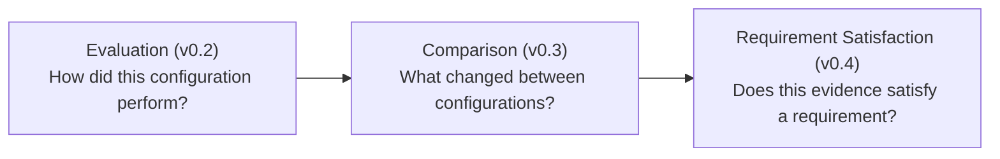
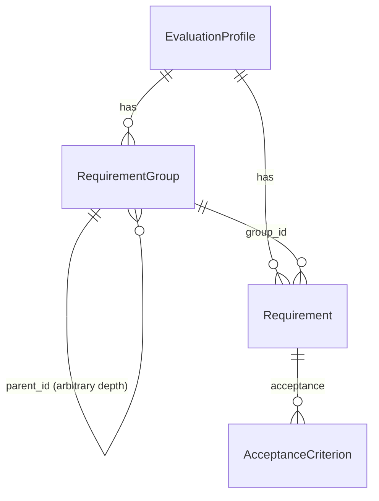

# Requirement Profile Contract (v0.4)

The authoritative reference for MultiSens's requirement-profile layer:
the domain model, validation, storage, and the profile API surface. See
[coverage.md](coverage.md) for how a profile's requirements are actually
evaluated against evidence and aggregated into coverage,
[condition-explorer.md](condition-explorer.md) for the v0.5 layer that
filters/groups/cross-tabulates that coverage by condition, and
[comparison.md](comparison.md) for the layer directly below this one.

## What this layer answers

> Given a profile containing configurable requirements, which
> requirements are satisfied by each sensor configuration?

A fundamentally different question from v0.3's:



MultiSens's core has **no built-in knowledge of any specific
requirement framework** — no NCAP, no DMS/OMS certification scheme, no
automotive-specific logic anywhere in `app/domain/profiles.py` or
`coverage.py`. A profile representing such a framework is something an
external user builds with the generic shapes below, entirely outside
the core. See [the synthetic reference profile](#synthetic-reference-profile)
for a worked example that is deliberately *not* one of those frameworks.

## Domain model

Defined in
[`backend/app/domain/profiles.py`](../backend/app/domain/profiles.py) —
zero `fastapi`/`sqlite3`/`rclpy` imports, same discipline as every other
domain module.



- **`AcceptanceCriterion`** — `metric` (a lookup key, see
  [coverage.md](coverage.md#metric-lookup)), `operator`
  (`>=`/`<=`/`>`/`<`/`==`), `value` (float).
- **`Requirement`** — `id`, `group_id` (every requirement belongs to a
  real group — no loose top-level requirements, so aggregation is always
  a clean sum over groups), `name`, `description`, `task`, `conditions`
  (open dict, see below), `acceptance` (non-empty list of
  `AcceptanceCriterion`), `metadata`.
- **`RequirementGroup`** — `id`, `parent_id` (`None` = top-level), `name`,
  `description`, `metadata`. Adjacency-list hierarchy, arbitrary depth —
  chosen over a materialized-path or nested-set representation because
  this project's target scale (tens to hundreds of requirements) never
  needs the query performance those would buy, and adjacency list is
  what `sessions.scenario_id` and every other FK-shaped relationship in
  this schema already uses.
- **`EvaluationProfile`** — `id`, `name`, `version`, `description`,
  `format_version`, `groups`, `requirements`, `metadata`, `created_at`
  (server-assigned, same convention as `Session.started_at`).

### No `mandatory` or `weight` field

Deliberately absent. Neither has an aggregation semantic defined in v0.4
— an unused field would only invite premature use before one exists.
Adding either later is an additive migration (one more nullable column
on the stored document), not a breaking one.

### Conditions: open by design, non-negotiable

`Requirement.conditions` is `dict[str, str | float | bool]` — never a
fixed set of columns (`illumination`, `eyewear`, `smoke`, ...). A
private profile with hundreds of `lighting × occlusion × eyewear ×
weather` combinations is just hundreds of `Requirement` rows in one
document; a brand-new condition dimension works the first time it
appears, with zero core-code change. See
[coverage.md](coverage.md#condition-matching) for the matching rule.

### Immutable, explicitly versioned

There is no update endpoint. A changed profile is a new `id`/`version`,
never a mutation of an existing row — so every `RequirementResult` stays
reproducible against the exact `profile_id`/`profile_version` that
produced it. `POST /api/profiles` *is* the validation gate (see below);
there is no separate `/validate` route and no partial acceptance.

## Validation

[`validate_profile`](../backend/app/domain/profiles.py) — collects
*every* problem in one pass, never fails fast, so a caller sees
everything wrong in one round trip:

- Duplicate group id / duplicate requirement id.
- A group's `parent_id` referencing a group that doesn't exist.
- A parent-group cycle (self-loop or multi-node) — detected by walking
  each group's ancestor chain, bounded by the group count.
- A requirement's `group_id` referencing a group that doesn't exist.
- A requirement with a blank (or whitespace-only) `task`.
- A criterion with a non-finite threshold (`NaN`/`±inf` — a `NaN`
  comparison silently always evaluates `False` in Python, which would
  otherwise fail every requirement using it without ever saying why) or
  a blank metric name.
- An empty profile (zero requirements).

Structurally malformed input (an unsupported operator, an empty
`acceptance` list, wrong field types) is rejected one layer earlier, by
Pydantic itself, before an `EvaluationProfile` instance can even exist —
`validate_profile` only checks relationships *between* fields that
parsing alone can't.

## Storage

One `evaluation_profiles` table
(`backend/app/persistence/migrations/0003_profiles.sql`): `id`, `name`,
`version` (duplicated into real columns for cheap listing), `document`
(the entire validated profile as one JSON blob), `created_at`. **Not**
normalized into `requirement_groups`/`requirements` tables — a profile
is always read whole (coverage needs the entire hierarchy) and never
queried partially, and every other structured field in this schema
(`tags`, `metadata`, `value`, `metrics`, `sensor_ids`, ...) is already
"TEXT, (de)serialized in `repository.py`." A profile document is just a
bigger instance of the same pattern.

## API surface

```
POST /api/profiles                      # validate + persist, 201, 409 on duplicate id
GET  /api/profiles                      # summary list - id/name/version/requirement_count, not full documents
GET  /api/profiles/{id}                 # full document
POST /api/profiles/{id}/coverage        # see coverage.md
```

No update, no delete — confirmed by a dedicated test that `PUT`/`PATCH`/
`DELETE` all 404/405.

## Frontend

`frontend/src/pages/Profiles.tsx` — list plus a JSON-paste import form
(the two-layer validation above surfaces as one bullet-per-problem list,
not a single run-on error string).
`frontend/src/pages/ProfileDetail.tsx` — a read-only hierarchy tree
(`frontend/src/groupTree.ts`'s `buildGroupTree`, shared with the
coverage matrix) plus the coverage view described in
[coverage.md](coverage.md#frontend).

## Synthetic reference profile

[`examples/profiles/README.md`](../examples/profiles/README.md) —
"Generic Cabin Safety Demo," deliberately not modeled on or named after
any real regulatory or certification framework. Four groups, eight
requirements across three condition dimensions (`illumination`/
`occlusion`/`eyewear`), six sessions, five configurations, every accuracy
value exact by construction. See that README for the full derivation and
the independent-verification test (`backend/tests/test_profile_demo.py`)
that recomputes all 40 requirement×configuration cells without importing
any production coverage code.

## Known profile-layer limitations

See [limitations.md](limitations.md) for the current authoritative
list; summarized here: conditions are flat scalars only (no nested
condition maps), no profile-level PASS/FAIL/INCOMPLETE status (raw
counts and per-configuration coverage only — see
[coverage.md](coverage.md#no-profile-level-status)), no weighted or
mandatory-requirement aggregation, `RequirementResult`s are never
persisted (recomputed fresh on every `/coverage` call).
